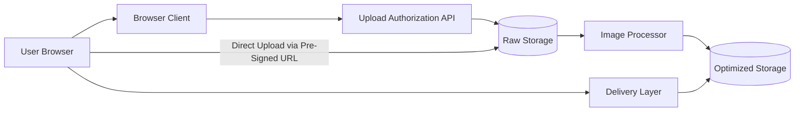

# Serverless Content Delivery & Optimization API

Documentation-first and implementation-ready monorepo for a serverless media upload, optimization, and delivery platform on AWS using Java backend services and a React browser client.

## Project Overview

Users upload images through a browser-based client. The browser does not send the file through the backend. It first requests a short-lived pre-signed upload URL from the control-plane API. The browser then uploads the file directly to storage. After upload, background processing creates optimized assets and thumbnails. Final assets are delivered through a CDN-style read path.

## Beginner-Friendly Explanation

This project is an image pipeline:

- one part gives safe upload permission
- one part stores the original file
- one part processes the image in the background
- one part delivers the optimized result quickly

## Architecture

- `frontend/`
  React client that requests pre-signed upload URLs and reflects asynchronous asset readiness
- `backend/`
  Lightweight Java modules for upload authorization, image processing, shared services, and local integration support
- `infra/`
  AWS SAM template for API Gateway, Cognito, S3, Lambda, and CloudFront
- `config/`
  Shared environment source of truth
- `scripts/`
  Config rendering utilities for frontend and infrastructure
- `api/`
  OpenAPI contract for the control-plane endpoint
- `learn/`
  Day-by-day teaching path for building the project and preparing for interviews

## High-Level Flow



## Technologies Used

- Java
- AWS SDK for Java v2
- Maven
- Thumbnailator
- React
- TypeScript
- Vite
- AWS SAM
- Amazon S3
- API Gateway
- AWS Lambda
- Amazon Cognito
- Amazon CloudFront

## Shared Configuration

The canonical environment file is:

- [`config/shared-environment.json`](/home/preetsirohi/Desktop/serveless-content-delievery/config/shared-environment.json)

Generate derived config artifacts with:

```bash
node scripts/render-config.mjs
```

For local Docker testing:

```bash
node scripts/render-config.mjs --profile local
```

That command updates:

- [`frontend/public/runtime-config.json`](/home/preetsirohi/Desktop/serveless-content-delievery/frontend/public/runtime-config.json)
- [`infra/parameters/generated.shared.json`](/home/preetsirohi/Desktop/serveless-content-delievery/infra/parameters/generated.shared.json)

## Current Stack

- Frontend: React + TypeScript + Vite
- Backend: Java multi-module Maven project
- Infrastructure: AWS SAM
- Local integration: Docker Compose + LocalStack
- Production auth boundary: Amazon Cognito

## Architecture Diagrams

- [Overview Diagram](/home/preetsirohi/Desktop/serveless-content-delievery/serverless-content-delivery-docs/diagrams/architecture-overview.md)
- [Local Development Diagram](/home/preetsirohi/Desktop/serveless-content-delievery/serverless-content-delivery-docs/diagrams/local-development-architecture.md)
- [Production AWS Diagram](/home/preetsirohi/Desktop/serveless-content-delievery/serverless-content-delivery-docs/diagrams/production-aws-architecture.md)

## Learning Path

- [15-Day Learning Track](/home/preetsirohi/Desktop/serveless-content-delievery/learn/README.md)
- [Build From Scratch Guide](/home/preetsirohi/Desktop/serveless-content-delievery/learn/build-from-scratch-guide.md)

## Documentation Reading Order

Start here:

- [`serverless-content-delivery-docs/documentation/01-project-overview.md`](/home/preetsirohi/Desktop/serveless-content-delievery/serverless-content-delivery-docs/documentation/01-project-overview.md)
- [`serverless-content-delivery-docs/documentation/03-system-architecture.md`](/home/preetsirohi/Desktop/serveless-content-delievery/serverless-content-delivery-docs/documentation/03-system-architecture.md)
- [`serverless-content-delivery-docs/documentation/04-end-to-end-request-flow.md`](/home/preetsirohi/Desktop/serveless-content-delievery/serverless-content-delivery-docs/documentation/04-end-to-end-request-flow.md)
- [`serverless-content-delivery-docs/documentation/07-api-gateway-architecture.md`](/home/preetsirohi/Desktop/serveless-content-delievery/serverless-content-delivery-docs/documentation/07-api-gateway-architecture.md)
- [`serverless-content-delivery-docs/documentation/08-lambda-architecture.md`](/home/preetsirohi/Desktop/serveless-content-delievery/serverless-content-delivery-docs/documentation/08-lambda-architecture.md)

## Local End-To-End Testing

The repo includes a local integration path:

- `frontend-local`
  Browser UI on `http://localhost:5173`
- `backend-local`
  Local Java HTTP API on `http://localhost:8080`
- `localstack`
  Local S3-compatible storage on `http://localhost:4566`

Run it with:

```bash
node scripts/render-config.mjs --profile local
docker compose -f docker-compose.local.yml up --build
```

Local behavior:

1. The browser requests a pre-signed upload URL from the local Java API.
2. The browser uploads directly to the raw LocalStack bucket.
3. The local processor poller detects the new raw object.
4. Optimized and thumbnail JPEGs are written into the local optimized bucket.
5. The browser can open the final local asset URLs.

## Learning Outcomes

After working through this repository, a student should be able to:

- explain direct upload vs backend upload
- explain pre-signed URL security
- explain asynchronous processing
- explain control plane vs data plane
- explain Cognito’s role in login and API protection
- explain the backend file structure and service responsibilities
- explain the project in intern-level interviews

## Notes

- Dummy Cognito and endpoint values are intentionally checked in for now.
- Local mode bypasses production auth so the flow stays testable offline.
- Progress tracking lives in [`implementation.md`](/home/preetsirohi/Desktop/serveless-content-delievery/implementation.md).
