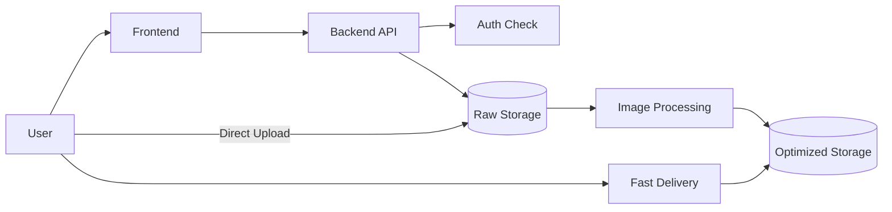

# Day 1: Understand The Internet, Apps, And This Project

## Today’s Goal

Today she should understand:

- what a web app is
- what frontend means
- what backend means
- what an API means
- what storage means
- what authentication means
- what this project does from start to finish

## Simple Explanation

When a user uses a web app, many parts work together.

- The `frontend` is what the user sees.
- The `backend` is the logic behind the app.
- The `API` is how frontend and backend talk.
- `Storage` is where data or files are kept.
- `Authentication` checks who the user is.

This project is about uploading an image, processing it, and delivering it fast.

## Real-Life Analogy

Think of this project like an airport:

- `Frontend` is the check-in counter the passenger sees
- `Backend/API` is the staff checking the ticket
- `S3` is the storage room
- `Lambda` is the worker doing background tasks
- `CloudFront` is the fast delivery network
- `Cognito` is identity checking at the gate

## Project In One Line

User logs in, requests upload permission, uploads image directly to storage, system processes the image, and final image is delivered fast.

## Diagram



## Learn These Words Today

- `Frontend`
- `Backend`
- `API`
- `Request`
- `Response`
- `Authentication`
- `Storage`
- `Processing`
- `CDN`
- `System Design`

## What Problem This Project Solves

Raw images from users are usually:

- too large
- slow to load
- expensive to store and transfer

So the system:

- uploads safely
- processes the image
- creates smaller versions
- serves them fast

## Why This Project Is Good For Learning

This one project teaches:

- backend basics
- request and response thinking
- API design
- Java coding
- JavaScript needed for browser requests
- storage thinking
- async processing
- basic cloud system design

## What To Read In The Repo Today

- [`serverless-content-delivery-docs/documentation/01-project-overview.md`](/home/preetsirohi/Desktop/serveless-content-delievery/serverless-content-delivery-docs/documentation/01-project-overview.md)
- [`README.md`](/home/preetsirohi/Desktop/serveless-content-delievery/README.md)
- [`api/openapi.yaml`](/home/preetsirohi/Desktop/serveless-content-delievery/api/openapi.yaml)

## Exercise

Write answers in a notebook:

1. What is frontend?
2. What is backend?
3. What is an API?
4. Why do we not upload big images through the backend?
5. What is the job of storage in this project?

## Expected Answer Hints

- frontend means user-facing part
- backend means logic and rules
- API means communication contract
- big files through backend create load
- storage keeps files safely

## Mini Interview Practice

Question: What does this project do?

Good beginner answer:

This project lets a user upload an image, then the system processes the image and serves an optimized version faster. It teaches frontend, backend, storage, authentication, and system design together.

## Teacher Notes

- Spend extra time making sure she understands backend, API, and storage in plain words.
- Ask her to explain the project as a story, not as technical keywords.

## Build Today

- Write the full project flow in 5 simple sentences in a notebook.
- Draw one box diagram showing user, backend, storage, processing, and delivery.

## Exact Code To Write Today

Create a small practice file:

`practice/day01-project-flow.js`

```js
const projectFlow = [
  "1. User logs in",
  "2. Browser asks backend for upload permission",
  "3. Backend returns pre-signed upload URL",
  "4. Browser uploads image directly to storage",
  "5. Processor creates optimized image",
  "6. Final image is delivered to the user"
];

for (const step of projectFlow) {
  console.log(step);
}
```

What this code does:

- stores the full project flow in order
- prints each step
- helps the student remember the system as a sequence

## Common Mistakes

- memorizing words without understanding flow
- thinking backend and storage are the same thing
- thinking upload and processing happen at the same time

## End Of Day Success Check

She is ready for Day 2 if she can explain the full app in 5 simple sentences.
