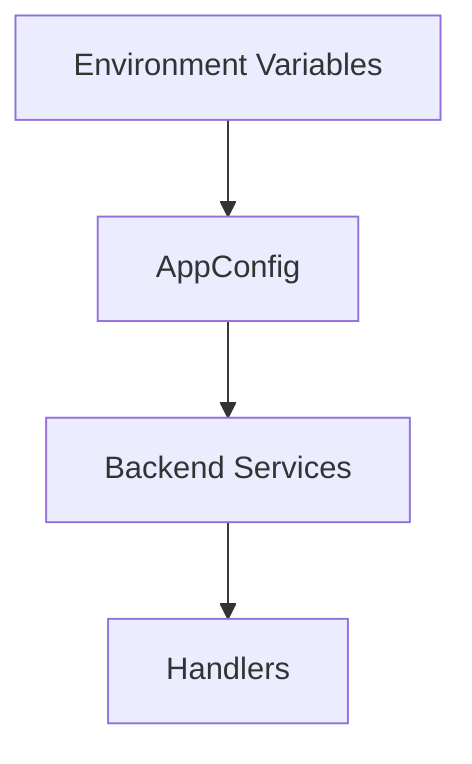

# Day 2: Java Basics For This Backend

## Today’s Goal

Today she should understand the Java basics needed for this project.

## Why Java Matters Here

The backend and Lambda code in this repo is written in Java.

She does not need all of Java first.
She only needs the parts useful for this project.

## Must-Know Java Concepts

- class
- object
- method
- constructor
- package
- import
- `public`, `private`
- `static`
- `final`
- exception
- record

## Very Simple Explanation

- A `class` is like a blueprint.
- An `object` is a real thing made from that blueprint.
- A `method` is an action.
- A `record` is a simple way to store data.

## Mini Example

```java
public record UploadRequest(String fileName, String contentType, long sizeBytes) {
}
```

This means:

- we want to store three values
- file name
- content type
- file size

## Backend File Reading Guide

Read these files slowly:

- [`backend/shared/src/main/java/com/serverless/contentdelivery/shared/domain/UploadAuthorizationRequest.java`](/home/preetsirohi/Desktop/serveless-content-delievery/backend/shared/src/main/java/com/serverless/contentdelivery/shared/domain/UploadAuthorizationRequest.java)
- [`backend/shared/src/main/java/com/serverless/contentdelivery/shared/domain/UploadAuthorizationResponse.java`](/home/preetsirohi/Desktop/serveless-content-delievery/backend/shared/src/main/java/com/serverless/contentdelivery/shared/domain/UploadAuthorizationResponse.java)
- [`backend/shared/src/main/java/com/serverless/contentdelivery/shared/config/AppConfig.java`](/home/preetsirohi/Desktop/serveless-content-delievery/backend/shared/src/main/java/com/serverless/contentdelivery/shared/config/AppConfig.java)

## Why AppConfig Matters

`AppConfig` is where the application reads settings from the environment.

This teaches an important backend rule:

Do not hardcode environment-specific values in code if they can change.

## Diagram



## What She Should Notice In Code

- Java files are inside packages
- data is modeled cleanly
- backend logic is being separated into services
- configuration is read once and reused

## Java Habits To Build

- give good names
- keep methods small
- keep one class focused on one job
- do not mix everything in one file

## Exercise

Open `AppConfig.java` and answer:

1. What values does this project read from environment?
2. Why is config not hardcoded?
3. What would happen if bucket names changed?

## Expected Answer Hints

- region, bucket names, prefixes, limits, URLs
- config should change by environment
- changing bucket names should not require changing logic

## Mini Interview Practice

Question: Why did you use records?

Good answer:

I used Java records for simple request and response models because they are cleaner, smaller, and easier to understand for data-only objects.

## Teacher Notes

- Do not overload her with full Java theory.
- Keep bringing Java back to real project files.

## Build Today

- Open `UploadAuthorizationRequest.java` and explain each field.
- Open `AppConfig.java` and write what each environment value controls.

## Exact Code To Write Today

Create this file:

`practice/day02/UploadAuthorizationRequest.java`

```java
package practice.day02;

public record UploadAuthorizationRequest(
        String fileName,
        String contentType,
        long sizeBytes) {
}
```

Then create this file:

`practice/day02/AppConfigExample.java`

```java
package practice.day02;

public record AppConfigExample(
        String awsRegion,
        String rawBucketName,
        String optimizedBucketName,
        long maxUploadSizeBytes) {
}
```

What this code does:

- teaches how backend request data is modeled
- teaches how config data is stored cleanly
- shows that records hold data, not business logic

## Common Mistakes

- mixing up class and object
- thinking records contain business logic
- skipping package and import understanding

## End Of Day Success Check

She is ready for Day 3 if she can read a simple Java record and explain what it stores.
