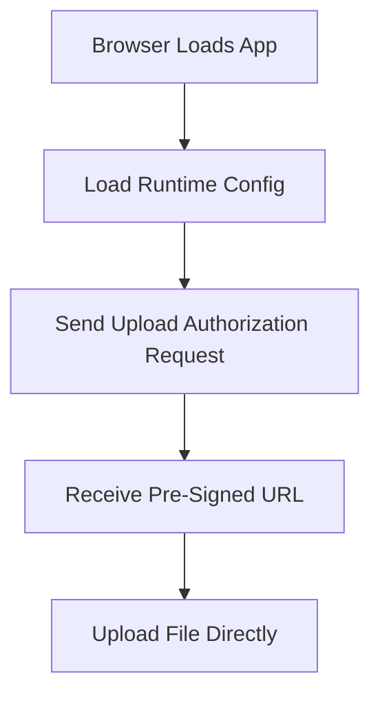

# Day 3: JavaScript Basics Needed To Understand Browser Requests

## Today’s Goal

Today she should understand the JavaScript basics needed for this project.

## What She Needs To Know

- variable
- function
- object
- array
- `async` and `await`
- component
- state
- props
- `useEffect`

## Very Simple Explanation

In this project, JavaScript matters because the browser must:

- load config
- send API requests
- receive responses
- upload the file directly

## Files To Read Today

- [`frontend/src/App.tsx`](/home/preetsirohi/Desktop/serveless-content-delievery/frontend/src/App.tsx)
- [`frontend/src/api/uploadApi.ts`](/home/preetsirohi/Desktop/serveless-content-delievery/frontend/src/api/uploadApi.ts)
- [`frontend/src/config/runtime.ts`](/home/preetsirohi/Desktop/serveless-content-delievery/frontend/src/config/runtime.ts)

## Browser Request Diagram



## What `async` Means Here

Some work takes time.

For example:

- calling backend API
- uploading file
- loading runtime config

So browser code uses async logic and waits for results.

## Important JavaScript Idea

The browser does not do heavy backend work.
It mainly:

- asks for upload authorization
- uploads the file
- shows status to the user

## Exercise

Answer these:

1. Which file talks to the backend API?
2. Why does upload need `async` code?
3. Why is browser code not the right place for image processing logic?
4. Why should browser code stay simple in this architecture?

## Expected Answer Hints

- browser waits for network calls
- heavy logic belongs on backend side
- simple browser code is easier to maintain

## Mini Interview Practice

Question: Why do we need JavaScript in this project?

Good answer:

JavaScript lets the browser call the backend, receive the pre-signed URL, upload the file directly to storage, and update the user about what is happening.

## Teacher Notes

- Keep this day light and practical.
- Teach only the JavaScript needed to understand requests, responses, and async flow.

## Build Today

- Read `uploadApi.ts` and write down the order of operations.
- Explain what `await` is doing in one sentence.

## Exact Code To Write Today

Create this file:

`practice/day03/requestUploadAuthorization.js`

```js
async function requestUploadAuthorization() {
  const payload = {
    fileName: "sample-image.png",
    contentType: "image/png",
    sizeBytes: 2048
  };

  const response = await fetch("http://localhost:8080/v1/uploads/presign", {
    method: "POST",
    headers: {
      "Content-Type": "application/json",
      "Authorization": "Bearer dummy-token"
    },
    body: JSON.stringify(payload)
  });

  const data = await response.json();
  console.log(data);
}

requestUploadAuthorization().catch(console.error);
```

What this code does:

- sends file metadata to backend
- waits for backend response
- prints the upload authorization result

## Common Mistakes

- thinking browser code should contain backend logic
- fearing async code without following the step order
- focusing too much on UI details instead of request flow

## End Of Day Success Check

She is ready for Day 4 if she can explain how browser code talks to backend and storage.
