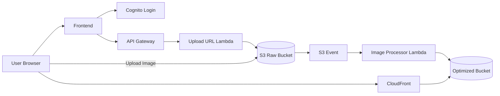
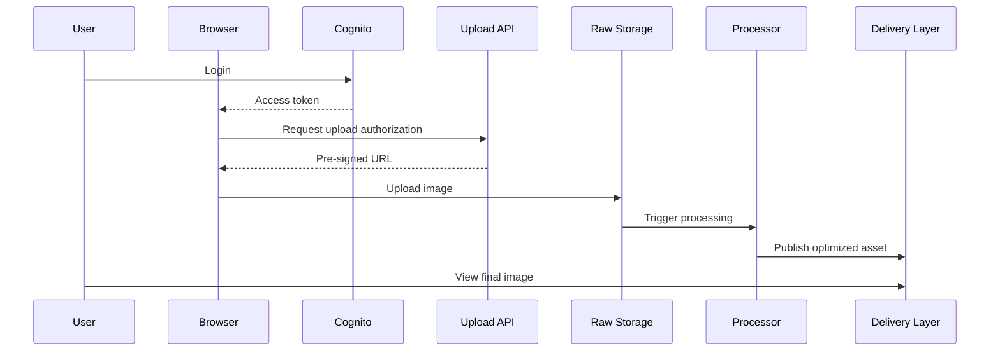

# Day 4: Full System Design Of This Project

## Today’s Goal

Today she should understand the complete request flow from login to final image delivery.

## Main System Parts

- browser client
- Cognito login
- upload authorization API
- raw image storage
- image processor
- optimized image storage
- delivery layer

## Production Flow



## Very Simple Story

1. User logs in.
2. Browser asks backend for upload permission.
3. Backend checks request and returns pre-signed URL.
4. Browser uploads directly to storage.
5. Storage triggers processor.
6. Processor creates optimized image.
7. User later sees the final image through delivery layer.

## Why This Design Is Good

- backend does not carry heavy image file traffic
- upload stays fast
- processing is separate
- read traffic and upload traffic are separated

## What Is Control Plane And Data Plane

Simple meaning:

- `Control plane` = deciding and validating
- `Data plane` = actual file movement

In this project:

- API is control plane
- direct upload to S3 is data plane

## Important Design Rule

Do not send large files through the backend if storage can safely take them directly.

## Request Lifecycle Diagram



## Backend Thinking Focus

Today focus on these questions:

1. Which part validates the request?
2. Which part stores the file?
3. Which part processes the file?
4. Which part serves the final image?
5. Which part is synchronous and which part is asynchronous?

## Exercise

Draw this system on paper using boxes and arrows.

Then answer:

1. What happens before upload?
2. What happens during upload?
3. What happens after upload?

## Expected Answer Hints

- before upload means login and upload authorization
- during upload means browser sends file to storage
- after upload means processor creates derived outputs

## Mini Interview Practice

Question: Why not upload through the backend?

Good answer:

Because image files can be large. If every image goes through the backend, the backend becomes slower, more expensive, and harder to scale. Direct upload to storage is better.

## Teacher Notes

- This is one of the most important days in the whole track.
- Make sure she can redraw the full system from memory.

## Build Today

- Draw the full architecture once with labels.
- Draw the request lifecycle again without looking at the file.
- Mark which parts are synchronous and which are asynchronous.

## Exact Code To Write Today

Create this file:

`practice/day04/systemParts.js`

```js
const systemParts = {
  auth: "Cognito",
  api: "Upload Authorization API",
  rawStorage: "S3 Raw Bucket",
  processor: "Image Processor",
  optimizedStorage: "S3 Optimized Bucket",
  delivery: "CloudFront"
};

console.log(systemParts);
```

What this code does:

- names the main architecture parts
- helps the student separate roles clearly
- makes the system easier to explain from memory

## Common Mistakes

- mixing login with upload
- mixing authorization API with direct upload
- forgetting that processing happens after upload

## End Of Day Success Check

She is ready for Day 5 if she can explain this flow without mixing up auth, backend API, storage, and processing roles.
