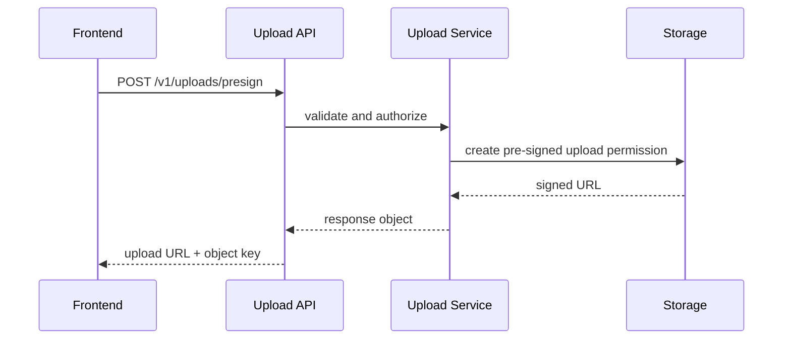

# Day 5: API Design And The Upload Authorization API

## Today’s Goal

Today she should understand:

- what API design means
- why we need an upload authorization API
- what request and response look like

## What API We Are Making

Main API:

- `POST /v1/uploads/presign`

Its job:

- accept file metadata
- validate request
- return a short-lived pre-signed upload URL

## Why This API Exists

We do not want to give the browser full storage access.

We want:

- controlled upload
- allowed file types only
- limited expiration
- server-generated object key

## API Contract

Read:

- [`api/openapi.yaml`](/home/preetsirohi/Desktop/serveless-content-delievery/api/openapi.yaml)

## Diagram



## Request Example

The frontend sends:

- file name
- content type
- file size

## Response Example

The backend returns:

- object key
- upload URL
- expiration time
- delivery URLs

## Why Request Validation Matters

Without validation:

- wrong file type may upload
- huge files may upload
- unsafe object names may be used

## Files To Read Today

- [`backend/shared/src/main/java/com/serverless/contentdelivery/shared/validation/UploadRequestValidator.java`](/home/preetsirohi/Desktop/serveless-content-delievery/backend/shared/src/main/java/com/serverless/contentdelivery/shared/validation/UploadRequestValidator.java)
- [`backend/shared/src/main/java/com/serverless/contentdelivery/shared/service/UploadAuthorizationService.java`](/home/preetsirohi/Desktop/serveless-content-delievery/backend/shared/src/main/java/com/serverless/contentdelivery/shared/service/UploadAuthorizationService.java)

## Exercise

Write simple answers:

1. Why is this API needed?
2. Why does frontend send metadata and not the image itself?
3. What should backend validate?

## Expected Answer Hints

- the API creates safe upload permission
- browser sends metadata first because backend only needs to validate and sign
- backend validates type, size, and request structure

## Mini Interview Practice

Question: What is the purpose of the upload authorization API?

Good answer:

Its purpose is to safely give a user short-lived permission to upload one file directly to storage without exposing broad storage access.

## Teacher Notes

- Keep asking: what problem does this API solve?
- Make sure she understands that the file body does not go through this API.

## Build Today

- Open `openapi.yaml` and write the request fields and response fields in a notebook.
- Explain why the backend should generate the object key.

## Exact Code To Write Today

Create this file:

`api/openapi.yaml`

```yaml
openapi: 3.0.3
info:
  title: Upload Authorization API
  version: 1.0.0
paths:
  /v1/uploads/presign:
    post:
      summary: Create pre-signed upload URL
      requestBody:
        required: true
        content:
          application/json:
            schema:
              type: object
              required:
                - fileName
                - contentType
                - sizeBytes
              properties:
                fileName:
                  type: string
                contentType:
                  type: string
                sizeBytes:
                  type: integer
      responses:
        "200":
          description: Upload URL created
```

What this code does:

- defines the API contract first
- makes backend and browser agree on request shape
- teaches contract-first design

## Common Mistakes

- thinking this API uploads the actual file
- ignoring validation rules
- trusting client input too much

## End Of Day Success Check

She is ready for Day 6 if she understands why API design is about rules, not only code.
