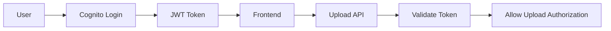

# Day 6: Authentication, Cognito, And Security Basics

## Today’s Goal

Today she should understand:

- what login means
- what authentication means
- what authorization means
- where Cognito fits

## Very Simple Meaning

- `Authentication` = who are you?
- `Authorization` = what are you allowed to do?

## Cognito’s Role In This Project

Cognito is for:

- login
- token issuance
- protecting the upload authorization API

Cognito is not for:

- processing images
- storing files
- resizing images

## Security Flow



## Why We Need Auth Here

Without auth:

- anyone can request upload URLs
- abuse becomes easy
- storage can be misused
- cost can rise

## Local Testing Note

In local testing, auth is bypassed on purpose.

Why?

Because the goal of local mode is to test the full flow easily.

But in production:

- login must be real
- token validation must be real

## Files To Read Today

- [`infra/template.yaml`](/home/preetsirohi/Desktop/serveless-content-delievery/infra/template.yaml)
- [`config/shared-environment.json`](/home/preetsirohi/Desktop/serveless-content-delievery/config/shared-environment.json)
- [`config/local-overrides.json`](/home/preetsirohi/Desktop/serveless-content-delievery/config/local-overrides.json)

## Exercise

Answer:

1. What is authentication?
2. What is authorization?
3. Why should upload URL requests be protected?
4. Why is local auth bypass okay only for local learning?

## Expected Answer Hints

- authentication means identity
- authorization means permission
- protected upload requests reduce abuse
- local bypass is only for teaching and testing

## Mini Interview Practice

Question: Where does Cognito fit in your project?

Good answer:

Cognito is used for user login and token issuance. The frontend sends the token to the upload API, and the backend or API Gateway uses that token to protect upload authorization.

## Teacher Notes

- Repeat the difference between authentication and authorization until it is natural.
- Keep Cognito’s role small and clear: login and token-based protection.

## Build Today

- Draw a mini flow of user login, token, API call, and validation.
- Write one sentence for authentication and one sentence for authorization.

## Exact Code To Write Today

Create this file:

`practice/day06/authHeader.js`

```js
const accessToken = "dummy-access-token";

const headers = {
  "Content-Type": "application/json",
  "Authorization": `Bearer ${accessToken}`
};

console.log(headers);
```

What this code does:

- shows how a token is sent to a protected API
- teaches the browser-side shape of authenticated requests
- connects login with API protection

## Common Mistakes

- thinking Cognito uploads files
- mixing token validation with storage permission
- not separating local bypass from production auth

## End Of Day Success Check

She is ready for Day 7 if she clearly understands the difference between login and upload.
