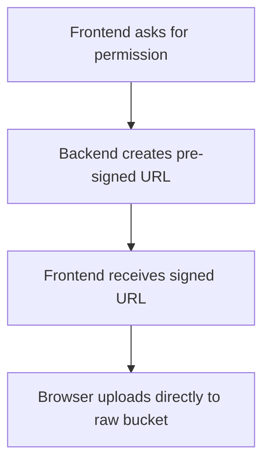

# Day 7: S3, Direct Upload, And Pre-Signed URLs

## Today’s Goal

Today she should understand:

- what object storage is
- what S3 does
- what direct upload means
- what pre-signed URL means

## What Is S3 In Simple Words

S3 is file storage in the cloud.

We use it because:

- it stores images well
- it scales well
- it works nicely with direct uploads

## What Is Direct Upload

Direct upload means:

- frontend does not send the file to backend
- frontend uploads the file directly to storage

## Why Direct Upload Is Better

- less backend load
- better scalability
- lower backend bandwidth
- cleaner architecture

## What Is A Pre-Signed URL

A pre-signed URL is a temporary, limited permission link.

It says:

- this file can be uploaded
- to this place
- for this short time

## Diagram



## File To Read Today

- [`backend/shared/src/main/java/com/serverless/contentdelivery/shared/service/UploadAuthorizationService.java`](/home/preetsirohi/Desktop/serveless-content-delievery/backend/shared/src/main/java/com/serverless/contentdelivery/shared/service/UploadAuthorizationService.java)

## Key Ideas

- backend controls object key
- upload permission expires fast
- request is validated first
- browser only gets narrow permission

## Exercise

Explain in simple words:

1. What is S3?
2. What is direct upload?
3. What is pre-signed URL?
4. Why is pre-signed URL safer than giving full access?

## Expected Answer Hints

- S3 is object storage
- direct upload skips backend file transfer
- pre-signed URL is temporary limited permission
- full access is too broad for a browser

## Mini Interview Practice

Question: Why use pre-signed URLs?

Good answer:

Pre-signed URLs let the client upload directly to storage for a short time and only for a specific object. This reduces backend load and improves security compared to broad access.

## Teacher Notes

- Make her say this flow out loud multiple times.
- This topic often becomes the strongest interview point if explained simply.

## Build Today

- Write the 4-step pre-signed URL flow from memory.
- Explain why full S3 access is unsafe for the browser.

## Exact Code To Write Today

Create this file:

`practice/day07/directUpload.js`

```js
async function uploadFileToStorage(uploadUrl, file) {
  const response = await fetch(uploadUrl, {
    method: "PUT",
    headers: {
      "Content-Type": file.type
    },
    body: file
  });

  if (!response.ok) {
    throw new Error("Direct upload failed.");
  }

  console.log("Upload completed");
}
```

What this code does:

- sends the real file directly to storage
- skips the backend for file transfer
- demonstrates the data plane of the system

## Common Mistakes

- thinking pre-signed URL is permanent
- thinking pre-signed URL means public bucket
- forgetting that backend validates before signing

## End Of Day Success Check

She is ready for Day 8 if she can explain direct upload with confidence.
