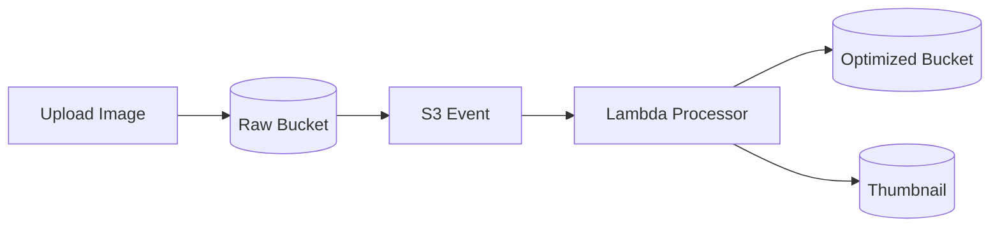

# Day 8: Async Processing, Lambda, And Image Workflow

## Today’s Goal

Today she should understand:

- what asynchronous processing means
- why processing should happen after upload
- what Lambda is doing

## Simple Meaning Of Async

Async means:

one task finishes first, and another task starts later.

In this project:

- upload happens first
- image optimization happens after upload

## Why Not Process During Upload

If we process during upload:

- user waits longer
- failures become more painful
- upload path becomes heavy

## Better Design

- upload fast
- process later
- store final result

## Diagram



## What The Processor Does

- reads raw image
- resizes image
- compresses image
- writes optimized image
- writes thumbnail

## Files To Read Today

- [`backend/image-processor-lambda/src/main/java/com/serverless/contentdelivery/processor/ImageProcessorHandler.java`](/home/preetsirohi/Desktop/serveless-content-delievery/backend/image-processor-lambda/src/main/java/com/serverless/contentdelivery/processor/ImageProcessorHandler.java)
- [`backend/shared/src/main/java/com/serverless/contentdelivery/shared/service/ImageProcessingService.java`](/home/preetsirohi/Desktop/serveless-content-delievery/backend/shared/src/main/java/com/serverless/contentdelivery/shared/service/ImageProcessingService.java)

## Important Beginner Lesson

This is a big system design idea:

separate the fast user path from the heavy background path.

## Exercise

Answer:

1. What is async processing?
2. Why is it useful here?
3. What does the image processor create?

## Expected Answer Hints

- async means work happens later
- useful because upload stays fast
- processor creates optimized image and thumbnail

## Mini Interview Practice

Question: Why is image optimization asynchronous?

Good answer:

It is asynchronous so the user does not wait for resizing and compression during upload. The upload stays fast and processing happens in the background.

## Teacher Notes

- Use a restaurant analogy if needed: order first, cooking happens after.
- Keep stressing separation of user path and heavy background path.

## Build Today

- Draw the raw bucket to processor to optimized bucket flow.
- Write one sentence on why async improves user experience.

## Exact Code To Write Today

Create this file:

`practice/day08/ImageJob.java`

```java
package practice.day08;

public class ImageJob {
    public void process(String objectKey) {
        System.out.println("Reading raw image: " + objectKey);
        System.out.println("Creating optimized image");
        System.out.println("Creating thumbnail");
        System.out.println("Writing outputs to optimized storage");
    }
}
```

What this code does:

- shows the processing steps in order
- teaches input, work, and output thinking
- prepares the student for the real processor service

## Common Mistakes

- thinking the user waits for processing before upload succeeds
- mixing upload success with final asset readiness
- forgetting that processing can fail separately

## End Of Day Success Check

She is ready for Day 9 if she can explain why upload and processing are separate.
