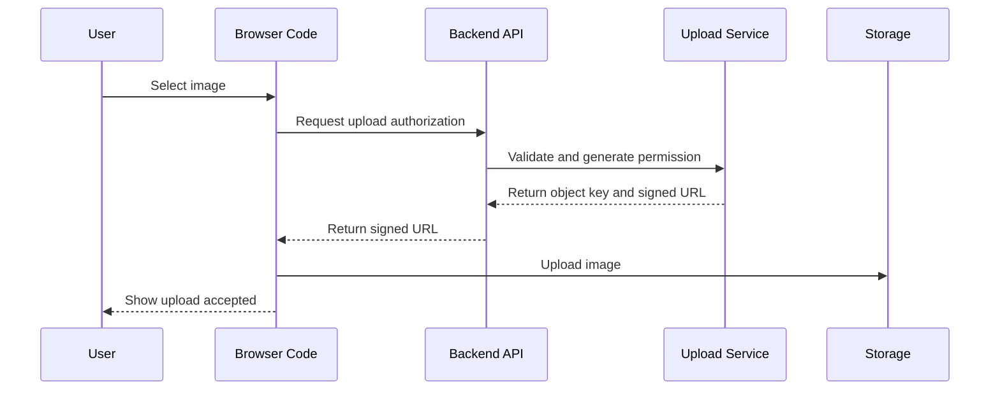

# Day 9: Full Request Lifecycle From Browser To Backend Service

## Today’s Goal

Today she should understand exactly how one upload request moves from the browser into backend logic and then into storage.

## Main Responsibilities In This Flow

- browser collects file metadata
- browser sends upload authorization request
- backend validates the request
- backend returns pre-signed upload permission
- browser uploads the file directly
- processor later creates final assets

## Main Flow



## Files To Read Slowly

- [`frontend/src/api/uploadApi.ts`](/home/preetsirohi/Desktop/serveless-content-delievery/frontend/src/api/uploadApi.ts)
- [`backend/upload-url-lambda/src/main/java/com/serverless/contentdelivery/upload/UploadUrlHandler.java`](/home/preetsirohi/Desktop/serveless-content-delievery/backend/upload-url-lambda/src/main/java/com/serverless/contentdelivery/upload/UploadUrlHandler.java)
- [`backend/shared/src/main/java/com/serverless/contentdelivery/shared/service/UploadAuthorizationService.java`](/home/preetsirohi/Desktop/serveless-content-delievery/backend/shared/src/main/java/com/serverless/contentdelivery/shared/service/UploadAuthorizationService.java)
- [`backend/shared/src/main/java/com/serverless/contentdelivery/shared/validation/UploadRequestValidator.java`](/home/preetsirohi/Desktop/serveless-content-delievery/backend/shared/src/main/java/com/serverless/contentdelivery/shared/validation/UploadRequestValidator.java)

## What To Notice In The Full Path

- the browser only sends metadata first
- the backend owns validation rules
- the backend owns object key generation
- storage receives the real file body
- processing is separated from authorization

This is good backend design because important rules stay on the server side.

## Important System Design Idea

upload success does not mean optimized image is ready immediately.

That is called `eventual consistency`.

Simple meaning:

the system needs a little time before the final derived image is ready.

## Exercise

Write answers:

1. Why must backend validate file type even if browser already checked it?
2. Why does the backend generate the object key instead of trusting the client?
3. Why does upload success not always mean final image is instantly ready?

## Expected Answer Hints

- browser checks are not enough for security
- backend should control naming and storage paths
- processing happens after upload

## Mini Interview Practice

Question: Walk me through one upload request from browser to backend.

Good answer:

The browser collects file metadata and asks the backend for upload authorization. The backend validates the request and returns a pre-signed URL. Then the browser uploads the file directly to storage, and later a background processor creates the optimized result.

## Teacher Notes

- Even though browser code appears here, teach this day as a backend request lifecycle lesson.
- Keep the student focused on where the real rules live.

## Build Today

- Trace one request through browser code, handler, validation, service, and storage.
- Write which layer owns which responsibility.

## Exact Code To Write Today

Create this file:

`practice/day09/RequestLifecycle.java`

```java
package practice.day09;

public class RequestLifecycle {
    public static void main(String[] args) {
        System.out.println("Browser sends metadata to backend");
        System.out.println("Backend validates request");
        System.out.println("Backend returns pre-signed URL");
        System.out.println("Browser uploads file to storage");
        System.out.println("Processor creates final assets");
    }
}
```

What this code does:

- reinforces the exact request lifecycle
- keeps focus on backend steps
- helps the student explain the flow clearly

## Common Mistakes

- trusting browser-side validation as enough
- not separating metadata request from file upload
- forgetting that the backend owns object naming and rules

## End Of Day Success Check

She is ready for Day 10 if she can walk through the full request lifecycle in order.
