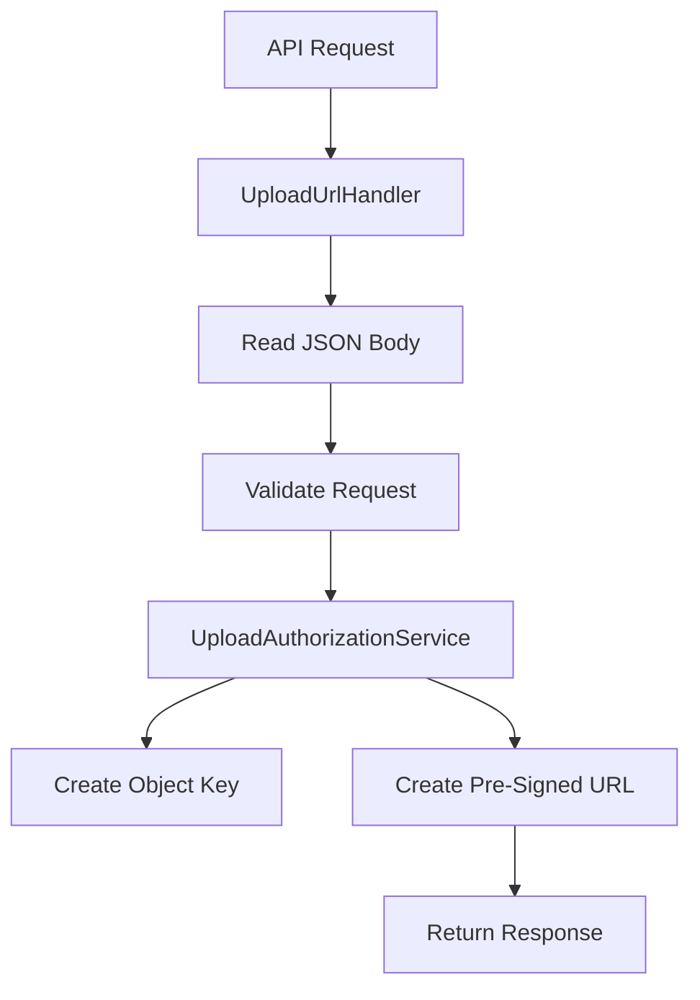

# Day 10: Backend Upload URL Service Implementation

## Today’s Goal

Today she should understand how the upload authorization backend is built.

## Backend Upload Path

- handler receives request
- request body is parsed
- request is validated
- service creates object key
- service creates pre-signed URL
- response is returned

## Diagram



## Files To Read Today

- [`backend/upload-url-lambda/src/main/java/com/serverless/contentdelivery/upload/UploadUrlHandler.java`](/home/preetsirohi/Desktop/serveless-content-delievery/backend/upload-url-lambda/src/main/java/com/serverless/contentdelivery/upload/UploadUrlHandler.java)
- [`backend/shared/src/main/java/com/serverless/contentdelivery/shared/service/UploadAuthorizationService.java`](/home/preetsirohi/Desktop/serveless-content-delievery/backend/shared/src/main/java/com/serverless/contentdelivery/shared/service/UploadAuthorizationService.java)
- [`backend/shared/src/main/java/com/serverless/contentdelivery/shared/validation/UploadRequestValidator.java`](/home/preetsirohi/Desktop/serveless-content-delievery/backend/shared/src/main/java/com/serverless/contentdelivery/shared/validation/UploadRequestValidator.java)

## Important Architecture Lesson

The `handler` should stay thin.

That means:

- handler accepts request
- handler calls service
- service contains business logic

This makes code easier to test and understand.

## What Is Business Logic Here

- validating allowed file type
- limiting size
- generating safe object key
- generating response

## Exercise

Answer:

1. Why should handler be thin?
2. What logic belongs in validator?
3. What logic belongs in service?

## Expected Answer Hints

- handler should not hold all business logic
- validator checks request rules
- service owns upload authorization behavior

## Mini Interview Practice

Question: Why separate handler and service?

Good answer:

I separate them so transport logic and business logic do not get mixed. The handler deals with request and response, and the service handles the real upload authorization logic.

## Teacher Notes

- This is a core backend design day.
- Make sure she can point at real code and say what each layer does.

## Build Today

- Open the handler and mark request parsing, service call, and response creation.
- Open the service and mark business logic.

## Exact Code To Write Today

Create this file:

`backend/upload-url-lambda/src/main/java/com/example/upload/UploadUrlHandler.java`

```java
package com.example.upload;

public class UploadUrlHandler {
    public String handleRequest(String requestBody) {
        System.out.println("Read request body");
        System.out.println("Validate request");
        System.out.println("Call upload authorization service");
        System.out.println("Return JSON response");
        return "{\"message\":\"upload authorization created\"}";
    }
}
```

What this code does:

- teaches the role of the handler
- keeps the handler thin
- shows request in, response out structure

## Common Mistakes

- putting all logic in one file
- mixing validation, transport, and business logic
- not naming layers clearly

## End Of Day Success Check

She is ready for Day 11 if she understands the difference between handler, validator, and service.
