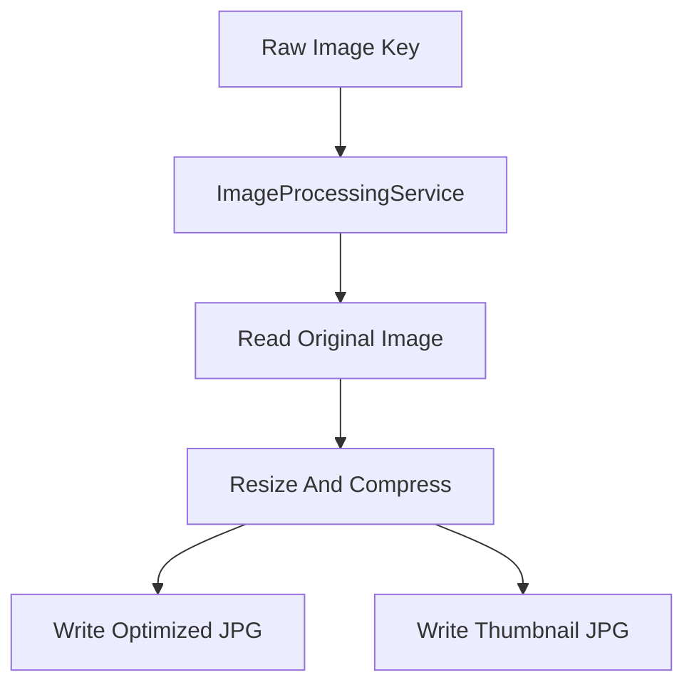

# Day 11: Backend Image Processor Implementation

## Today’s Goal

Today she should understand how the raw image becomes optimized output.

## Processor Flow

- event or local poll finds raw image
- processor reads image
- processor creates optimized image
- processor creates thumbnail
- processor stores final files

## Diagram



## Files To Read Today

- [`backend/image-processor-lambda/src/main/java/com/serverless/contentdelivery/processor/ImageProcessorHandler.java`](/home/preetsirohi/Desktop/serveless-content-delievery/backend/image-processor-lambda/src/main/java/com/serverless/contentdelivery/processor/ImageProcessorHandler.java)
- [`backend/shared/src/main/java/com/serverless/contentdelivery/shared/service/ImageProcessingService.java`](/home/preetsirohi/Desktop/serveless-content-delievery/backend/shared/src/main/java/com/serverless/contentdelivery/shared/service/ImageProcessingService.java)

## What She Should Notice

- processor checks output key
- service reuses config
- output is written as JPEG
- thumbnail is smaller than optimized image

## Important Design Lesson

Background processing should be:

- focused
- repeatable
- safe if run again

This is called `idempotent thinking`.

Simple meaning:

If the processor is triggered again, it should not create chaos.

## Exercise

Answer:

1. What is the job of image processor?
2. Why are there two outputs?
3. Why is idempotent thinking useful?

## Expected Answer Hints

- processor reads raw input and writes derived outputs
- optimized image and thumbnail serve different needs
- repeated processing should stay safe

## Mini Interview Practice

Question: What does the image processor do?

Good answer:

The image processor reads the original uploaded image, creates an optimized version and a thumbnail, and stores them in the optimized delivery location.

## Teacher Notes

- Help her think like a backend engineer: input, work, output.
- This day is about data transformation and clean responsibility.

## Build Today

- Open `ImageProcessingService.java` and identify read, transform, and write steps.
- Explain the difference between optimized image and thumbnail.

## Exact Code To Write Today

Create this file:

`backend/shared/src/main/java/com/example/service/ImageProcessingService.java`

```java
package com.example.service;

public class ImageProcessingService {
    public void process(String objectKey) {
        System.out.println("Read original image: " + objectKey);
        System.out.println("Resize and compress image");
        System.out.println("Create thumbnail");
        System.out.println("Write optimized outputs");
    }
}
```

What this code does:

- teaches the core processing service shape
- separates business logic from event handler code
- reinforces backend transformation flow

## Common Mistakes

- mixing raw and optimized storage
- forgetting that one upload can create multiple outputs
- not understanding why repeated processing should be safe

## End Of Day Success Check

She is ready for Day 12 if she can explain raw bucket and optimized bucket separately.
