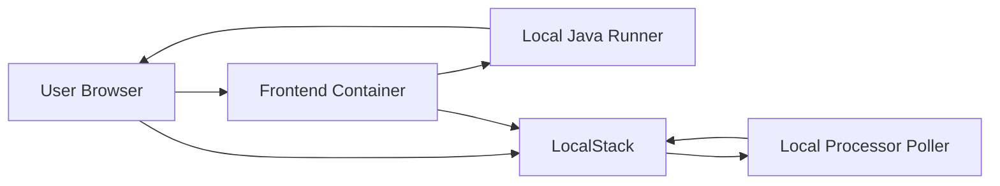

# Day 12: Local Testing With Docker And LocalStack

## Today’s Goal

Today she should understand how we test the full app locally.

## Why Local Testing Matters

Before using real cloud deployment, we want to prove:

- browser app works
- backend works
- upload works
- processing works
- final asset is created

## Local Architecture



## Files To Read Today

- [`docker-compose.local.yml`](/home/preetsirohi/Desktop/serveless-content-delievery/docker-compose.local.yml)
- [`backend/Dockerfile.local`](/home/preetsirohi/Desktop/serveless-content-delievery/backend/Dockerfile.local)
- [`frontend/Dockerfile.local`](/home/preetsirohi/Desktop/serveless-content-delievery/frontend/Dockerfile.local)
- [`backend/local-dev-runner/src/main/java/com/serverless/contentdelivery/local/LocalDevelopmentApplication.java`](/home/preetsirohi/Desktop/serveless-content-delievery/backend/local-dev-runner/src/main/java/com/serverless/contentdelivery/local/LocalDevelopmentApplication.java)

## Important Lesson

Local development does not need to copy production exactly.

It should mainly help us:

- understand flow
- debug easier
- build confidence

## Why We Added Local Java Runner

Because for teaching and testing, we want:

- one small local API
- one local processor loop
- simple end-to-end behavior

## Commands To Know

```bash
node scripts/render-config.mjs --profile local
docker compose -f docker-compose.local.yml up --build
```

## Exercise

Explain:

1. Why do we use Docker locally?
2. Why do we use LocalStack?
3. Why is a local runner useful for learning?

## Expected Answer Hints

- Docker runs services consistently
- LocalStack simulates cloud storage locally
- local runner makes the full flow easier to test

## Mini Interview Practice

Question: How do you test this project locally?

Good answer:

I use Docker Compose for the browser app, backend, and LocalStack. This lets me test upload authorization, direct storage upload, and background processing end to end before real deployment.

## Teacher Notes

- Do not let local Docker details distract from the system flow.
- Keep mapping every local part to the real production equivalent.

## Build Today

- Open `docker-compose.local.yml` and explain each service in one sentence.
- Explain why LocalStack is useful for storage testing.

## Exact Code To Write Today

Create this file:

`docker-compose.local.yml`

```yaml
services:
  frontend-local:
    image: node:20
    ports:
      - "5173:5173"

  backend-local:
    image: eclipse-temurin:21
    ports:
      - "8080:8080"

  localstack:
    image: localstack/localstack:3.5
    ports:
      - "4566:4566"
```

What this code does:

- defines local services
- gives each service a clear role
- teaches how the local system is composed

## Common Mistakes

- assuming local setup must look exactly like production
- getting lost in Docker commands without understanding why services exist
- forgetting the local runner is a teaching/testing helper

## End Of Day Success Check

She is ready for Day 13 if she understands why local testing and production architecture can be slightly different.
