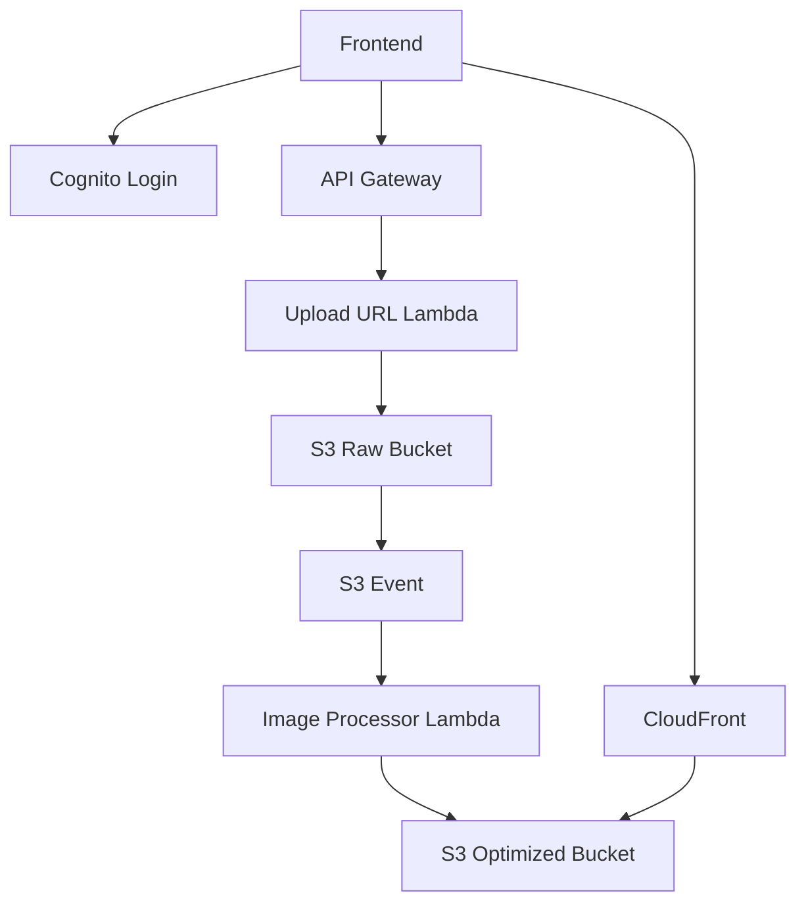

# Day 13: Cloud Architecture And Deployment Thinking

## Today’s Goal

Today she should understand how the local project maps to real AWS architecture.

## Real AWS Services In This Project

- Cognito
- API Gateway
- Lambda
- S3
- CloudFront

## Production Mapping



## What Changes From Local To Production

Local:

- uses local Java runner
- uses LocalStack
- bypasses Cognito

Production:

- uses Cognito login
- uses API Gateway
- uses Lambda
- uses real S3
- uses CloudFront

## Important Architecture Rule

Even when tooling changes, the core flow should stay the same.

That core flow is:

- login
- request upload permission
- direct upload
- background processing
- fast delivery

## Files To Read Today

- [`infra/template.yaml`](/home/preetsirohi/Desktop/serveless-content-delievery/infra/template.yaml)
- [`backend/upload-url-lambda/src/main/java/com/serverless/contentdelivery/upload/UploadUrlHandler.java`](/home/preetsirohi/Desktop/serveless-content-delievery/backend/upload-url-lambda/src/main/java/com/serverless/contentdelivery/upload/UploadUrlHandler.java)
- [`backend/image-processor-lambda/src/main/java/com/serverless/contentdelivery/processor/ImageProcessorHandler.java`](/home/preetsirohi/Desktop/serveless-content-delievery/backend/image-processor-lambda/src/main/java/com/serverless/contentdelivery/processor/ImageProcessorHandler.java)

## Exercise

Make a two-column table:

- local version
- production version

And map each service.

## Expected Answer Hints

- local uses simpler tools
- production uses AWS managed services
- the flow stays similar even when tools change

## Mini Interview Practice

Question: How does your local setup map to production?

Good answer:

Locally I use a small Java runner and LocalStack to simulate the flow. In production, that same flow maps to Cognito, API Gateway, Lambda, S3, and CloudFront.

## Teacher Notes

- This is where architecture thinking becomes stronger.
- Make sure she understands that tools may change but flow remains the same.

## Build Today

- Make a two-column table of local service and production service.
- Explain what changes and what stays the same.

## Exact Code To Write Today

Create this file:

`infra/template.yaml`

```yaml
AWSTemplateFormatVersion: '2010-09-09'
Transform: AWS::Serverless-2016-10-31
Resources:
  UploadUrlFunction:
    Type: AWS::Serverless::Function
    Properties:
      Runtime: java21
      Handler: com.example.upload.UploadUrlHandler::handleRequest

  ImageProcessorFunction:
    Type: AWS::Serverless::Function
    Properties:
      Runtime: java21
      Handler: com.example.processor.ImageProcessorHandler::handleRequest
```

What this code does:

- introduces infrastructure as code
- shows that AWS functions are defined as deployable resources
- connects local code to cloud deployment thinking

## Common Mistakes

- thinking local and production must be identical
- focusing on service names instead of service roles
- not seeing the shared core architecture

## End Of Day Success Check

She is ready for Day 14 if she can compare local and production clearly.
