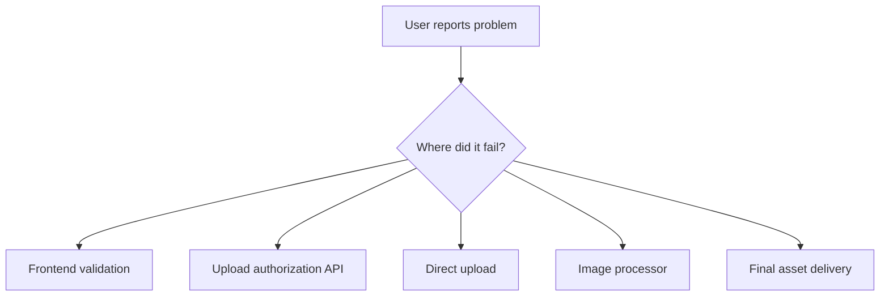

# Day 14: Debugging, Logging, Testing, And Failure Cases

## Today’s Goal

Today she should understand:

- how to debug this project
- where failures can happen
- how to think like a backend engineer

## Main Failure Points

- login fails
- upload API validation fails
- pre-signed URL upload fails
- raw object uploads but processing fails
- final image is missing

## Failure Diagram



## Debugging Mindset

Do not panic.
Trace one image through the system.

Ask:

1. Did frontend call API?
2. Did API return signed URL?
3. Did upload reach raw storage?
4. Did processor run?
5. Did optimized output get created?

## Testing Types

- frontend testing
- backend logic testing
- integration testing
- end-to-end testing

## Files To Read Today

- [`serverless-content-delivery-docs/documentation/20-testing-strategy.md`](/home/preetsirohi/Desktop/serveless-content-delievery/serverless-content-delivery-docs/documentation/20-testing-strategy.md)
- [`serverless-content-delivery-docs/documentation/16-error-handling-strategy.md`](/home/preetsirohi/Desktop/serveless-content-delievery/serverless-content-delivery-docs/documentation/16-error-handling-strategy.md)

## Exercise

Imagine this bug:

“Upload says success, but image is not showing.”

Write the 5 things you would check in order.

## Expected Answer Hints

- check API response
- check raw object exists
- check processor ran
- check optimized output exists
- check delivery path is correct

## Mini Interview Practice

Question: How would you debug this system?

Good answer:

I would trace one image through each stage: request upload URL, direct upload, raw storage, processor execution, optimized output creation, and final delivery path.

## Teacher Notes

- Teach calm debugging, not panic debugging.
- Always debug one request through one path.

## Build Today

- Write a step-by-step checklist for “image not visible”.
- Pick one failure point and explain what to inspect first.

## Exact Code To Write Today

Create this file:

`practice/day14/debugChecklist.js`

```js
const debugChecklist = [
  "1. Check upload API response",
  "2. Check raw object exists",
  "3. Check processor ran",
  "4. Check optimized output exists",
  "5. Check final delivery path"
];

for (const item of debugChecklist) {
  console.log(item);
}
```

What this code does:

- turns debugging into a fixed process
- teaches step-by-step thinking
- helps the student avoid random debugging

## Common Mistakes

- jumping randomly between components
- debugging without a flow
- assuming upload success means processing success

## End Of Day Success Check

She is ready for Day 15 if she can think through bugs step by step.
