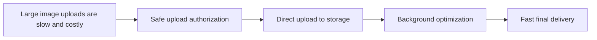

# Day 15: Interview Preparation And Final Project Explanation

## Today’s Goal

Today she should learn how to explain the project in a confident, simple, interview-friendly way.

## Best Simple Project Explanation

This project is a serverless image upload and delivery system. A user logs in, requests a short-lived upload URL, uploads the image directly to storage, then a background processor creates optimized versions, and the final image is delivered fast through a CDN.

## 60-Second Explanation

I built a serverless content delivery project where a browser client first asks the backend for a pre-signed upload URL. Then the browser uploads the file directly to storage instead of sending it through the backend. After upload, a processor creates optimized versions and thumbnails. In production, authentication is handled with Cognito, the control-plane API is protected, and final images are delivered through CloudFront.

## 5-Minute Explanation Structure

Use this order:

1. problem
2. architecture
3. main flow
4. why design choices were made
5. what you learned

## Interview Diagram



## Top Interview Questions

### 1. Why not upload through backend?

Because it makes the backend carry large file traffic, which is slower and harder to scale.

### 2. Why use pre-signed URLs?

To give short-lived, limited upload permission safely.

### 3. Why is image processing asynchronous?

So upload stays fast and heavy work happens in the background.

### 4. What does Cognito do?

It handles login and token-based protection for the upload authorization API.

### 5. What does CloudFront do?

It helps deliver optimized images quickly with caching.

## What To Say If Asked “What Did You Personally Build?”

Good answer:

I worked mainly on the backend upload authorization logic, the image processing flow, the storage design, the local testing setup, and the architecture documentation. I also learned how to separate control-plane APIs from direct file upload paths.

## Final Revision Checklist

- Can she explain browser client vs backend service?
- Can she explain the upload API?
- Can she explain pre-signed URL?
- Can she explain S3 raw vs optimized storage?
- Can she explain async processing?
- Can she explain Cognito’s role?
- Can she explain CloudFront’s role?
- Can she explain local vs production architecture?

## Final Exercise

Ask her to explain the whole project with no notes in:

- 30 seconds
- 1 minute
- 5 minutes

## Expected Answer Hints

- start with the problem
- explain upload authorization
- explain direct upload
- explain processing
- end with final delivery and learning outcome

## Teacher Advice

Do not try to sound too advanced.

Simple, correct, calm explanation is better than complicated wrong explanation.

For intern interviews, clarity is a superpower.

## Teacher Notes

- Make her practice speaking, not only reading.
- Ask for answers in 30 seconds, 1 minute, and 5 minutes.

## Build Today

- Record one 1-minute explanation of the project.
- Answer 5 interview questions without notes.

## Exact Code To Write Today

Create this file:

`practice/day15/projectAnswer.js`

```js
const oneMinuteAnswer =
  "This project is a serverless image upload and delivery system. " +
  "The browser first asks the backend for a pre-signed upload URL. " +
  "Then the browser uploads the file directly to storage. " +
  "After upload, a processor creates optimized images and thumbnails. " +
  "The final assets are delivered quickly through the delivery layer.";

console.log(oneMinuteAnswer);
```

What this code does:

- gives the student a clear spoken project summary
- helps her practice interview explanation in a structured way
- turns the explanation into a memorisable sequence

## Common Mistakes

- trying to sound too advanced
- giving too many details too early
- forgetting to explain the problem before the architecture

## End Of Course Success Check

She is ready if she can:

- explain the architecture simply
- point to major code files
- describe why each API and service exists
- reason about failures
- answer beginner-to-intern level system design questions
