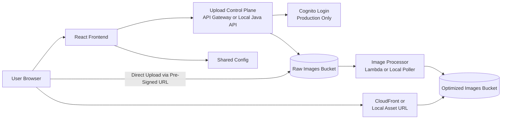

# Architecture Overview Diagram

## Implementation View

## Reading Notes

- Cognito belongs to login and token validation for the control plane, not to the direct upload path.
- The upload control path is synchronous and lightweight.
- The image optimization path is asynchronous and event-driven.
- The delivery path is cache-first in production and bucket-backed in local testing.
