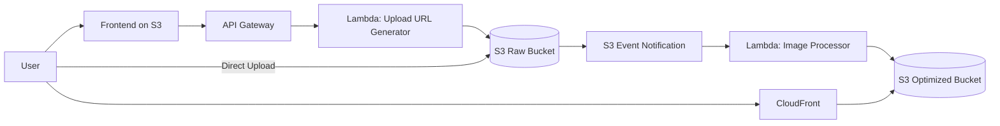

# Architecture Overview Diagram

## Reading Notes

- The upload control path is synchronous and lightweight.
- The image optimization path is asynchronous and event-driven.
- The delivery path is cache-first through CloudFront.
