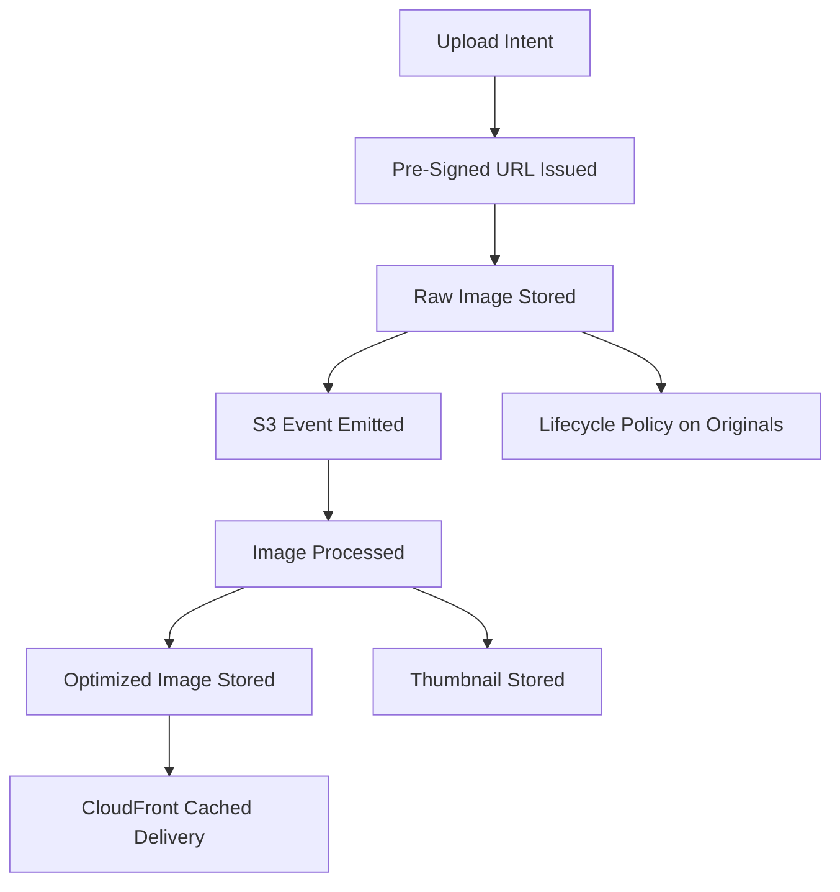

# Data Lifecycle Diagram

```mermaid
flowchart TD
    A[Upload Intent] --> B[Pre-Signed URL Issued]
    B --> C[Raw Image Stored]
    C --> D[S3 Event Emitted]
    D --> E[Image Processed]
    E --> F[Optimized Image Stored]
    E --> G[Thumbnail Stored]
    F --> H[CloudFront Cached Delivery]
    C --> I[Lifecycle Policy on Originals]
```

## Reading Notes

- The original and derived assets may have different retention policies.
- CloudFront caching is part of the asset lifecycle, not just a network detail.
