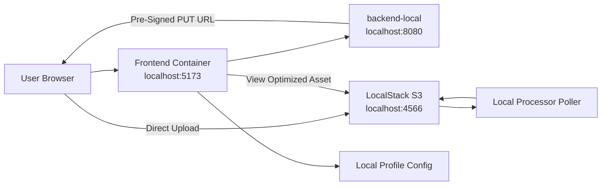

# Local Development Architecture

## Reading Notes

- This local path is designed for end-to-end verification without requiring real AWS credentials.
- Local auth bypass is intentional so browser uploads can be tested without a live Cognito login flow.
- The local processor polls raw storage because the local setup does not rely on full S3 event plumbing.
