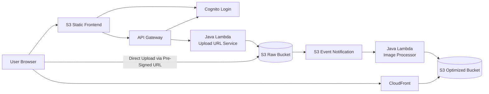

# Production AWS Architecture

## Reading Notes

- Cognito is responsible for login and token issuance.
- API Gateway uses Cognito-authenticated requests to protect upload authorization.
- The browser uploads directly to S3 only after the backend grants a short-lived pre-signed URL.
- CloudFront serves optimized assets and keeps the read-heavy path away from the control plane.
