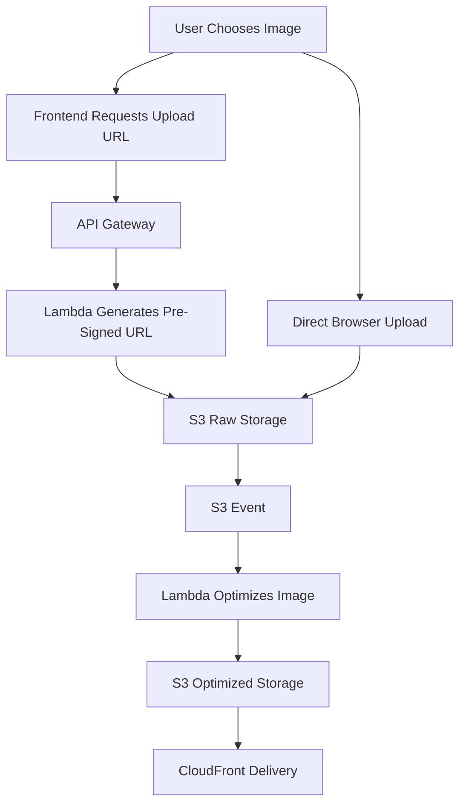

# 01 Project Overview

## Purpose

This document explains what the project does, why media delivery is a meaningful engineering problem, and why a serverless approach is a strong fit for beginner-friendly cloud learning with production relevance.

## Why This Component Exists

Modern products depend heavily on media. E-commerce sites need fast product images, social platforms need uploads from many users, and learning platforms need thumbnails and previews. Raw images from phones are often too large, too slow to load, and too expensive to store and transfer at scale. This project exists to solve that gap.

## Beginner-Friendly Explanation

Think of the system as a smart photo pipeline:

- Users send a photo into cloud storage.
- The system automatically creates smaller and cleaner versions.
- A CDN keeps the final image close to users around the world.

You are not building “an image upload API.” You are building a delivery pipeline that protects performance, cost, and user experience.

## Real-World Importance

- Instagram-style apps care about fast image rendering and many upload events.
- Netflix-style platforms use CDNs because users are geographically distributed.
- E-commerce platforms need thumbnails, zoom images, and cache-friendly URLs.
- News and blog platforms need lower image sizes to improve page load performance and SEO.

## Why Serverless Was Chosen

- Traffic can be unpredictable, especially for upload-heavy systems.
- You pay mostly for usage instead of idle servers.
- AWS services like S3, Lambda, and CloudFront already solve storage, events, scaling, and delivery.
- Beginners can learn cloud architecture without first operating VMs or containers.

## Why Alternatives Were Not Chosen

- Traditional backend upload servers add operational overhead and can become a bandwidth bottleneck.
- Monolithic Java web apps are heavier and less aligned with event-driven image pipelines.
- Spring Boot inside Lambda often increases cold start time and package size for a use case that does not need a full framework.

## Request And Response Flow

1. Frontend asks for a secure upload URL.
2. Lambda returns a pre-signed S3 URL.
3. Browser uploads directly to S3.
4. S3 triggers image-processing Lambda.
5. Optimized images are stored for delivery.
6. CloudFront serves the final version globally.

## Diagram

## Production Considerations

- Separate raw and optimized assets logically so accidental overwrite is harder.
- Standardize metadata such as uploader ID, content type, and upload timestamp.
- Decide early whether multiple image sizes are required for mobile, desktop, and thumbnails.

## Security Concerns

- Upload URLs must expire quickly.
- File type restrictions must be enforced before URL issuance and again during processing.
- Buckets should stay private unless there is a deliberate public-delivery decision.

## Cost Considerations

- Raw unoptimized images increase storage and data transfer costs.
- CDN caching lowers repeated origin fetches.
- Uncontrolled thumbnail generation can create storage explosion.

## Scaling Considerations

- S3 handles object scale well, but downstream processing concurrency must be managed.
- Viral uploads can create sudden Lambda bursts.
- CloudFront prevents delivery traffic from hammering S3 origin repeatedly.

## Common Mistakes

- Sending image files through the backend.
- Treating image optimization as optional rather than core product performance work.
- Forgetting that thumbnails, originals, and compressed versions each have lifecycle implications.

## Failure Scenarios

- Upload succeeds but processing fails, leaving only the raw object.
- Processing succeeds but CloudFront serves stale cached content.
- Users upload unsupported or malicious files with image-like extensions.

## Debugging Mindset

Trace the asset across stages:

- Was the pre-signed URL generated correctly?
- Did the file land in the expected raw prefix?
- Did the S3 event fire?
- Did the processing Lambda write the optimized output?
- Is CloudFront requesting the correct object key?

## Interview Questions And Answers

- Why is direct-to-S3 upload better than backend upload?
  It removes the application server from the heavy file-transfer path, reducing latency, bandwidth pressure, and scaling risk.
- Why is this project valuable beyond a demo?
  It touches storage, security, asynchronous events, performance, and cost optimization in one coherent system.

## Best Practices

- Design object keys intentionally for traceability and cache behavior.
- Keep infrastructure boundaries simple enough that each service has one clear job.
- Document state transitions so operations teams understand where assets can fail.
