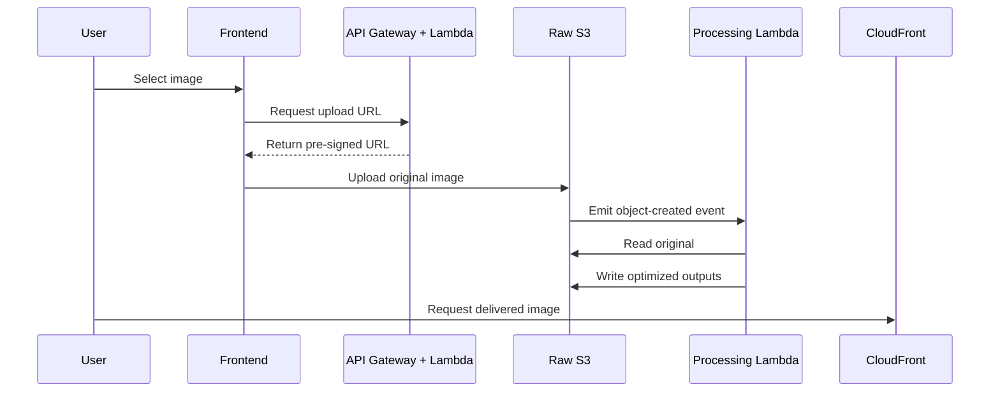

# 02 Business Problem

## Purpose

This document frames the real business problem behind the architecture so the technical choices feel justified rather than arbitrary.

## Beginner-Friendly Explanation

The simplest way to think about the problem is this: users want uploads to feel fast, viewers want images to load instantly, and the business wants that experience without paying for oversized files and overloaded backend servers.

## Why This Component Exists

Users want to upload images quickly, and consumers want those images to load fast everywhere. Businesses want lower infrastructure cost, lower operational complexity, and a safe way to handle user-generated content.

## Why This Exists

A naive image-upload design often pushes everything through a backend server, stores oversized originals without optimization, and serves files directly from storage without caching. That design works at tiny scale, then becomes expensive and slow.

## Why Direct Uploads Are Needed

- Application servers are expensive bandwidth relays.
- File uploads are large and slow compared with normal API requests.
- Backend instances become a bottleneck during spikes.
- Direct uploads allow browsers to stream straight into S3, which is designed for object storage at scale.

## Why Backend Upload Is Inefficient

With backend proxy upload, the file goes from browser to application server and then from application server to S3. That doubles traffic through the backend and forces compute resources to handle work that storage infrastructure already solves better.

## Why Optimization Reduces Cost

- Smaller files reduce S3 storage usage.
- Smaller files reduce CloudFront and internet transfer costs.
- Smaller files improve page speed, which improves user retention and conversion.

## Why CDN Matters

Without a CDN, every user request travels to the storage origin. With CloudFront, popular images are cached closer to users, reducing latency and shielding the origin from repetitive reads.

## Why Alternatives Were Not Chosen

- Self-hosted file servers require capacity planning, patching, scaling, and monitoring.
- Processing images synchronously during upload increases user-facing latency.
- Public buckets without CDN control are simpler at first but weaker for security, caching strategy, and enterprise governance.

## Request And Response Flow

1. Client asks for permission to upload.
2. System responds with a limited, time-bound URL.
3. Client uploads directly to storage.
4. Processing happens asynchronously in the background.
5. Users later fetch an optimized version from a CDN endpoint.

## Diagram

## Production Considerations

- Define acceptable upload size limits based on business needs.
- Decide whether users can replace images or only create immutable versions.
- Consider image moderation or malware scanning if content is user-generated.

## Security Concerns

- Abuse is possible if attackers repeatedly request upload URLs.
- MIME type claims from the browser cannot be fully trusted.
- Public distribution URLs should be intentionally separated from private upload paths.

## Cost Considerations

- A low-quality architecture wastes money in three places: backend bandwidth, oversized storage, and poor cache efficiency.
- Image transformations can also become costly if every request triggers on-demand processing without caching.

## Scaling Considerations

- Upload traffic and read traffic scale differently and should be decoupled.
- Event-driven processing prevents slow image transformation work from blocking the user interaction path.

## Common Mistakes

- Designing around developer convenience rather than traffic patterns.
- Ignoring read-heavy behavior after upload.
- Assuming image delivery is “just static hosting.”

## Failure Scenarios

- Upload URL generation service is available, but the S3 bucket policy blocks the actual upload.
- Images are optimized but never invalidated or versioned correctly, so old content remains visible.
- A sudden upload spike drives processing concurrency high enough to hit account-level Lambda limits.

## Debugging Mindset

Ask where the business pain shows up:

- Slow upload?
- Slow first-byte delivery?
- High storage cost?
- Cache misses?
- Processing backlog?

That helps isolate whether the issue is in upload, processing, storage design, or content delivery.

## Interview Questions And Answers

- Why optimize media before delivery?
  Because performance and cost improve together when images are right-sized for real usage.
- Why make processing asynchronous?
  It keeps the upload path fast and makes the system more resilient under spikes.

## Best Practices

- Design for the dominant business pattern: many reads, bursty writes, variable file sizes.
- Treat media delivery as a product performance problem, not only a storage problem.
