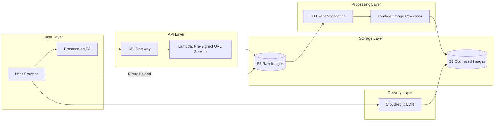
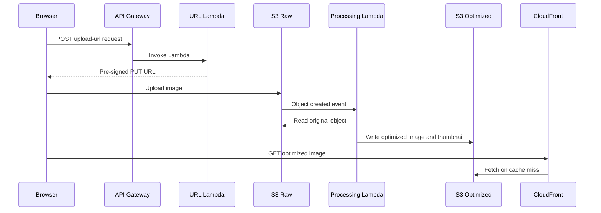

# 03 System Architecture

## Purpose

This document describes the full architecture, key boundaries, event-driven behavior, and how requests and data move through the system.

## Beginner-Friendly Explanation

This architecture separates three jobs: permission to upload, background image processing, and fast image delivery. Splitting those jobs keeps the system easier to scale and easier to explain.

## Why This Component Exists

The system has two user-facing flows:

- An upload preparation flow through API Gateway and a Lambda that creates pre-signed URLs.
- A delivery flow through CloudFront that serves optimized objects from S3.

The processing stage is asynchronous and event-driven.

## Why This Architecture Exists

It separates lightweight control-plane logic from heavyweight data-plane transfer:

- Control plane: authenticate, validate, authorize, and issue upload permission.
- Data plane: let S3 handle file transfer and persistence directly.

## Why Alternatives Were Not Chosen

- Synchronous image transformation during upload would increase wait time and reduce resilience.
- A single Lambda doing both URL issuance and processing would mix two different scaling profiles and concerns.
- EC2 or container-based workers offer flexibility but add infrastructure management that is not necessary for the learning goal.

## Diagram

## Sequence Diagram

## Event-Driven Explanation

S3 does not wait for image optimization before confirming upload success. It records the object, then emits an event. This means uploads stay fast, but the system becomes eventually consistent for the optimized asset. That tradeoff is usually acceptable and highly scalable.

## Request And Response Flow

1. Validate upload intent.
2. Generate temporary upload permission.
3. Persist original object.
4. Emit storage event.
5. Process image asynchronously.
6. Store derived assets.
7. Deliver through CDN with cache controls.

## Data Lifecycle

- Raw object enters the raw bucket or prefix.
- Metadata may capture uploader identity, original format, and processing state.
- Processor creates normalized outputs such as compressed original and thumbnail.
- Lifecycle policies can later archive or delete raw originals if business rules allow it.

## Production Considerations

- Define idempotency for repeated S3 events.
- Choose object key conventions that support tracing and cache versioning.
- Consider storing processing status if the frontend must know when derivatives are ready.

## Security Concerns

- Separate upload permissions from read permissions.
- Restrict CloudFront origin access to private S3 content.
- Guard against oversized uploads and untrusted file content.

## Cost Considerations

- Event-driven processing is cost-efficient for bursty workloads.
- Reprocessing every image version eagerly may waste cost if many sizes are rarely requested.

## Scaling Considerations

- URL generation Lambda scales independently of the processor Lambda.
- Read traffic scales mostly via CloudFront rather than Lambda.
- Concurrency controls may be required to protect image-processing costs during large ingestion spikes.

## Common Mistakes

- Ignoring eventual consistency in the user experience after upload.
- Using the same storage location for raw and optimized assets.
- Failing to decide whether overwritten uploads should invalidate CDN caches.

## Failure Scenarios

- S3 event is delivered more than once and processing writes duplicates.
- Processing times out on very large images.
- CloudFront caches a 404 before the optimized file is available.

## Debugging Mindset

Use stage-by-stage isolation:

- API problem or storage problem?
- Upload success or event failure?
- Processor read failure or write failure?
- Cache miss behavior or origin permission issue?

## Interview Questions And Answers

- Why split upload URL generation and image processing into separate Lambdas?
  Because the responsibilities, latency expectations, and scaling patterns are different.
- What tradeoff does the architecture make?
  It trades synchronous certainty for faster uploads and better scaling through asynchronous processing.

## Best Practices

- Keep boundaries explicit between request validation, storage, processing, and delivery.
- Make the asset lifecycle visible through metadata, logging, and naming conventions.
