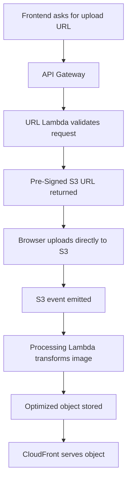

# 04 End-To-End Request Flow

## Purpose

This document walks through the request flow in detail so you can explain the exact user journey and system behavior.

## Beginner-Friendly Explanation

You can think of the system as two connected journeys: a short secure upload journey and a separate background processing journey. The user feels a fast upload, while the system does the heavier work afterward.

## Why This Component Exists

The flow is designed to keep user-facing operations fast while moving heavier processing into an asynchronous stage.

## Why Alternatives Were Not Chosen

- Uploading through a backend would slow the user path and consume backend bandwidth.
- Processing before confirming upload would increase latency and failure coupling.

## Request And Response Flow

1. User selects an image in the frontend.
2. Frontend sends a request for upload authorization, usually including filename, content type, and desired context.
3. API Gateway receives the request and forwards it to a Java Lambda.
4. Lambda validates request constraints and creates a pre-signed S3 upload URL.
5. Frontend uses the pre-signed URL to upload directly to the raw bucket.
6. S3 stores the object durably and emits an event notification.
7. Processing Lambda receives the event, downloads the image, and applies resizing and compression.
8. Lambda writes optimized outputs and a thumbnail into the optimized location.
9. User or consuming application fetches the final image through CloudFront.

## Request And Response View

- Upload authorization request:
  “May this user upload this kind of file to this location for a short time?”
- Upload authorization response:
  “Yes, here is a temporary signed URL and the object key.”
- Delivery request:
  “Give me the optimized image from the nearest edge cache.”

## Diagram

## Production Considerations

- Decide how the UI knows the optimized asset is ready.
- Include a correlation ID across API request, upload key, and processing logs.
- Choose whether the frontend immediately uses a placeholder image or polls for readiness.

## Security Concerns

- Upload authorization should validate user identity and intended storage path.
- Signed URLs should expire within minutes, not hours or days without business reason.
- Content type, size, and allowed prefixes should be controlled tightly.

## Cost Considerations

- The direct-upload model keeps API Gateway and Lambda costs focused on small control messages.
- Processing costs scale with image count and transformation complexity.

## Scaling Considerations

- Multiple users can upload simultaneously without holding open backend connections.
- Processing can fan out automatically as S3 events arrive.

## Common Mistakes

- Assuming upload success means optimized image is instantly available.
- Forgetting to plan object naming for versioning and cache invalidation.
- Logging too little detail to trace a single asset across the system.

## Failure Scenarios

- URL issued for one content type but client uploads another.
- Upload completes but event notification is misconfigured.
- Lambda writes output under the wrong key so CloudFront path does not match.

## Debugging Mindset

When a user says “my image is not showing,” check:

- Was the upload URL generated?
- Did S3 receive the object?
- Was the event trigger fired?
- Did the processor succeed?
- Did CloudFront request the right object path?

## Interview Questions And Answers

- Why does the frontend call API Gateway before uploading?
  To receive controlled, temporary permission rather than permanent storage credentials.
- Why is the delivery flow separate from the upload flow?
  Because read traffic is usually much larger and should be handled by a CDN, not by the upload path.

## Best Practices

- Keep the frontend aware of asynchronous state.
- Standardize key generation and metadata at upload time so later stages stay simple.
