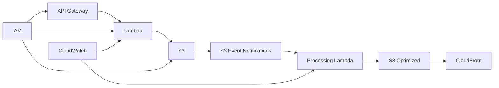

# 05 AWS Services Deep Dive

## Purpose

This document explains each core AWS service in the architecture and the reasoning for using it.

## Beginner-Friendly Explanation

Each AWS service in this project has one clear job: S3 stores files, Lambda runs focused logic, API Gateway controls requests, and CloudFront speeds up delivery. Understanding those boundaries makes the whole architecture much easier to learn.

## Why This Component Exists

These services were chosen because they fit a serverless, event-driven, low-operations architecture. The goal is to use managed services for undifferentiated infrastructure work and reserve engineering effort for system behavior and policy.

## Why Alternatives Were Not Chosen

No single AWS service can safely and efficiently handle upload control, durable storage, event-driven processing, and global caching by itself. The architecture uses multiple managed services because each solves a different part of the problem well.

## Diagram

## Amazon S3

- What it is:
  Durable object storage for raw and optimized images.
- Why we use it:
  Massive scale, strong AWS integration, event notifications, lifecycle rules, and high durability.
- Why not alternatives:
  EFS and block storage do not match web-scale object access patterns.
- Pricing and free tier:
  Pay for storage, requests, and transfer. Small experiments can stay very low cost, but repeated transformations and data transfer can grow.
- Security:
  Use private buckets, encryption, bucket policy restrictions, and carefully scoped write access.
- Best practice:
  Design prefixes for clarity, retention, and operational traceability.

## API Gateway

- What it is:
  Managed API front door for HTTPS requests.
- Why we use it:
  It handles routing, throttling, request validation, and Lambda integration cleanly.
- Why not alternatives:
  ALB can front Lambdas, but API Gateway is purpose-built for API features and auth patterns.
- Pricing and free tier:
  Charged by request volume; small learning projects often stay inexpensive.
- Security:
  Add authentication, throttling, WAF if needed, and structured request validation.
- Best practice:
  Keep the endpoint narrow and focused on upload authorization only.

## AWS Lambda

- What it is:
  Event-driven serverless compute.
- Why we use it:
  Ideal for short control-plane logic and bursty image-processing work.
- Why not alternatives:
  Containers and EC2 offer more control but require more operations and idle cost management.
- Pricing and free tier:
  Charged by invocation count and execution duration, influenced by memory allocation.
- Security:
  Least-privilege IAM, bounded timeouts, and dependency hygiene matter.
- Best practice:
  Split URL issuance from image processing because they have different runtime behavior.

## Amazon CloudFront

- What it is:
  Global content delivery network.
- Why we use it:
  Reduces latency and repeated origin reads.
- Why not alternatives:
  Direct S3 access is simpler but weaker for global caching, origin shielding, and controlled access patterns.
- Pricing and free tier:
  Primarily charged by transfer and requests; caching efficiency strongly affects cost.
- Security:
  Use private S3 origin access, HTTPS, and optionally signed delivery URLs.
- Best practice:
  Define TTL and invalidation strategy early.

## IAM

- What it is:
  Identity and access control for AWS resources.
- Why we use it:
  Every service interaction in this design relies on secure permission boundaries.
- Why not alternatives:
  There is no real replacement inside AWS for permission management.
- Pricing:
  IAM itself is not a major direct cost driver, but bad IAM design creates security and operational cost.
- Security:
  Follow least privilege and avoid wildcard permissions.
- Best practice:
  Separate roles by Lambda responsibility.

## CloudWatch

- What it is:
  AWS monitoring, logging, metrics, and alarms platform.
- Why we use it:
  Serverless systems are distributed, so logs and metrics are essential for visibility.
- Why not alternatives:
  Third-party observability tools can complement it, but CloudWatch is the default foundation.
- Pricing:
  Logs and custom metrics can grow in cost if retained carelessly.
- Security:
  Avoid logging sensitive data such as signed URLs or personal information.
- Best practice:
  Use structured logs and retention policies.

## S3 Event Notifications

- What it is:
  Trigger mechanism when objects are created in S3.
- Why we use it:
  It decouples upload from processing.
- Why not alternatives:
  Polling S3 would be slower, more complex, and less efficient.
- Pricing:
  The event itself is inexpensive, but downstream Lambda processing is the real workload cost.
- Security:
  Ensure only expected prefixes trigger processing.
- Best practice:
  Filter notifications by suffix or prefix to avoid unwanted loops.

## Request And Response Flow

1. API Gateway and Lambda handle small control requests.
2. S3 handles object persistence and event emission.
3. Processing Lambda handles asynchronous transformation.
4. CloudFront handles read-heavy delivery.

## Production Considerations

- Prefer clear ownership boundaries per service.
- Keep the event path simple before adding advanced components such as queues or workflows.
- Add queues later if retry isolation or traffic smoothing becomes necessary.

## Security Concerns

- The strongest architecture still fails if IAM and bucket policies are too broad.
- Observability systems must not leak sensitive identifiers or URLs.

## Cost Considerations

- S3 storage, CloudFront transfer, and Lambda duration are the primary drivers.
- API Gateway cost remains modest when it only handles small authorization requests.

## Scaling Considerations

- CloudFront handles read scaling.
- S3 handles object durability and high request rates.
- Lambda handles bursty processing if concurrency is managed.

## Common Mistakes

- Using CloudFront only as an afterthought instead of a core design element.
- Giving a Lambda role permission to many buckets and prefixes it does not need.
- Logging every detail forever without retention planning.

## Failure Scenarios

- API Gateway returns success but downstream IAM denies the pre-signed operation scope.
- CloudFront origin access is misconfigured, causing 403 responses.
- Event notifications accidentally trigger on optimized outputs and create loops.

## Debugging Mindset

When troubleshooting, ask which managed service boundary failed:

- API ingress
- Object write
- Event emission
- Compute processing
- CDN delivery

## Interview Questions And Answers

- Why is S3 a strong choice here?
  It provides durable object storage, event integration, and cost-efficient scale.
- Why use CloudFront instead of direct S3 delivery?
  CloudFront improves global latency, lowers repeated origin load, and enables stronger delivery controls.

## Best Practices

- Let each service do the job it was designed for.
- Favor managed integration points over custom glue where possible.
