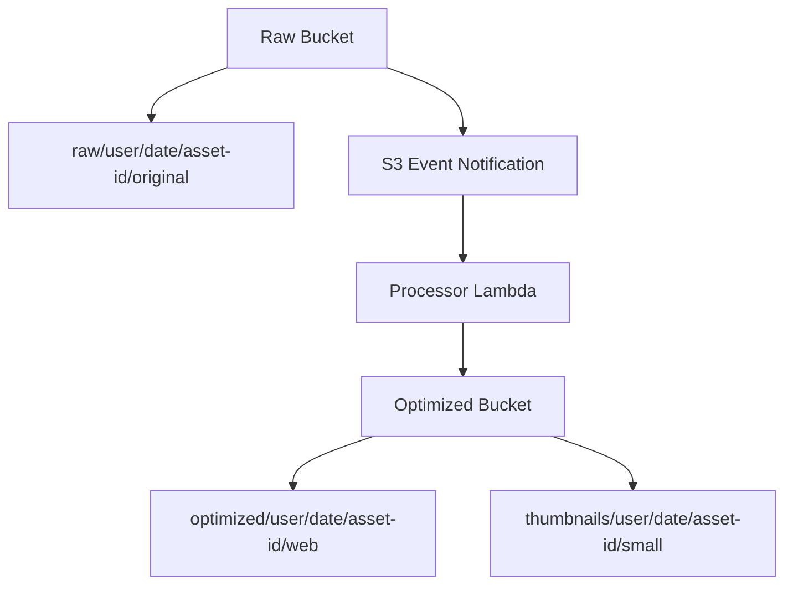

# 06 S3 Architecture

## Purpose

This document explains how to design S3 storage layout, naming, lifecycle, versioning, encryption, and access patterns for the project.

## Beginner-Friendly Explanation

S3 is the system’s warehouse. Good bucket and object-key design determines whether uploads are easy to manage, secure, debug, and clean up later.

## Why This Component Exists

In media systems, bucket and key design is not just organization. It affects security boundaries, lifecycle behavior, traceability, and how easy it is to reason about data over time.

## Why S3 Architecture Matters

In media systems, bucket and key design is not just organization. It affects security boundaries, lifecycle behavior, traceability, and how easy it is to reason about data over time.

## Bucket Design Options

- Separate buckets:
  One bucket for raw uploads and one bucket for optimized assets. This gives stronger separation and simpler policy design.
- Shared bucket with prefixes:
  Lower resource count, but policies and event filtering can become harder to reason about.

For beginner-friendly production design, separate buckets or at least clearly separated prefixes are strongly preferred.

## Suggested Folder Or Prefix Structure

- `raw/{tenant-or-user}/{date}/{asset-id}/original`
- `optimized/{tenant-or-user}/{date}/{asset-id}/web`
- `thumbnails/{tenant-or-user}/{date}/{asset-id}/small`

## Naming Strategy

- Use stable asset IDs instead of raw user filenames.
- Keep names deterministic so logs, retries, and cache paths stay traceable.
- Consider version markers if replacement uploads are allowed.

## Why Alternatives Were Not Chosen

- Random flat naming without structure makes troubleshooting and lifecycle rules harder.
- Public writeable buckets are operationally dangerous.
- Storing all variants beside the raw file without naming discipline creates confusion.

## Request And Response Flow

1. Lambda decides the raw object key.
2. Client uploads to that exact key.
3. S3 stores the original object and metadata.
4. Processor reads the original and writes derived outputs to optimized prefixes.

## Diagram

## Lifecycle Rules

- Keep raw originals for a shorter period if they are only needed for recovery or reprocessing.
- Keep optimized images longer because they are used for delivery.
- Archive rarely accessed originals only if restore latency is acceptable.

## Versioning

- Helpful when users replace assets or when accidental overwrite must be recoverable.
- Adds storage complexity and cost, so enable it intentionally.

## Encryption

- Use server-side encryption by default.
- If compliance demands stronger key control, use KMS-backed encryption and plan for key permissions.

## Access Control

- Raw buckets should remain private.
- Optimized objects may still remain private and be served through CloudFront origin access.
- Avoid public bucket policies unless the simplicity is worth the exposure and governance risk.

## Public Vs Private Bucket Decision

Private with CloudFront is usually the production choice because it centralizes delivery policy, TLS, caching, and access control. Public buckets reduce setup complexity but weaken security posture and delivery governance.

## Production Considerations

- Enable logging or inventory depending on audit needs.
- Standardize object metadata such as content type and source upload identifier.
- Protect against recursive processing if optimized outputs land in a triggering location.

## Security Concerns

- Prefix scoping matters when issuing upload URLs.
- Never allow arbitrary client-chosen paths without validation.
- Bucket policies should deny insecure transport and unexpected principals.

## Cost Considerations

- Storage classes and lifecycle transitions can reduce cost later.
- Versioning and excessive thumbnails can silently multiply storage expense.

## Scaling Considerations

- S3 handles high object scale well, but naming discipline and downstream event consumers still matter.
- Keep prefixes predictable for analytics and operations even though S3 no longer requires old-style randomization for scale.

## Common Mistakes

- Using user-uploaded filenames directly as permanent keys.
- Mixing raw and optimized outputs under the same event trigger path.
- Forgetting lifecycle rules for original oversized uploads.

## Failure Scenarios

- Object lands in wrong prefix, so event notification never fires.
- Encryption settings prevent processor Lambda from reading the object.
- Versioned replacements confuse CloudFront if object keys are reused without cache strategy.

## Debugging Mindset

Check:

- Which bucket and key was targeted?
- What metadata was stored?
- Did the expected event filter match?
- Did IAM allow read and write on the exact prefixes involved?

## Interview Questions And Answers

- Why use separate raw and optimized locations?
  It simplifies policy design, retention, and operational clarity.
- Should S3 buckets be public for a CDN-backed system?
  Usually no; private buckets with CloudFront origin access provide stronger control.

## Best Practices

- Treat object keys as part of system design, not an afterthought.
- Align lifecycle, delivery, and security decisions with asset purpose.
