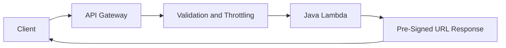

# 07 API Gateway Architecture

## Purpose

This document explains how API Gateway fits into the upload-control path and why it is a better fit than exposing direct AWS credentials to the client.

## Beginner-Friendly Explanation

API Gateway is the front desk of the system. It does not carry the image itself. It checks the request and routes it to the logic that decides whether an upload should be allowed.

## Why This Component Exists

The frontend needs a secure way to ask, “Can I upload this file?” API Gateway provides a managed entry point where the system can validate, authenticate, throttle, and route that request.

## REST APIs Vs HTTP APIs

- REST APIs offer richer built-in features and are often easier to discuss in interview settings when talking about mature API governance.
- HTTP APIs are simpler and often cheaper, which can be attractive for lean production designs.

Either can work. The architectural decision usually depends on required features, team familiarity, and future policy needs.

## Why API Gateway Was Chosen

- Easy Lambda integration.
- Central place for throttling and request validation.
- Built-in support for authentication and custom authorizers.
- Clear separation between public API contract and Lambda internals.

## Why Alternatives Were Not Chosen

- Exposing AWS credentials to the browser is unsafe.
- Application Load Balancer with Lambda can work, but API Gateway is more purpose-built for API concerns.
- A custom backend just to mint upload URLs adds unnecessary operations.

## Request And Response Flow

1. Client sends upload preparation request.
2. API Gateway authenticates and validates the request.
3. It invokes the URL-generation Lambda.
4. Lambda returns a pre-signed URL and object key.
5. API Gateway sends that response back to the client.

## Diagram

## Authentication

- For internal or learning scenarios, the API may start simple.
- For real user-facing systems, add identity verification so upload rights are tied to a user or tenant.
- Authentication is not only about blocking outsiders; it also scopes where approved users may upload.

## Rate Limiting

- Prevent abuse from repeated URL generation.
- Protect downstream Lambda and logging costs.
- Support fair usage and predictable traffic behavior.

## Production Considerations

- Validate request shape before invoking Lambda when possible.
- Return stable response formats so frontend logic remains simple.
- Consider idempotent client behavior for repeated requests caused by network retries.

## Security Concerns

- Do not accept arbitrary object keys from the client without server-side control.
- Keep CORS policy narrow and intentional.
- Protect against oversized file intent and unsupported content types.

## Cost Considerations

- API Gateway should only handle small metadata requests, not large file uploads.
- Excessive auth or logging verbosity can still add cost at scale.

## Scaling Considerations

- API Gateway scales well for high request volume, but the real benefit comes from keeping the upload body out of the API path.
- Because the response is lightweight, latency remains predictable.

## Common Mistakes

- Building an API that simply echoes back any requested S3 key.
- Allowing very long pre-signed URL expiration windows.
- Treating CORS as a frontend-only detail instead of a security boundary.

## Failure Scenarios

- API Gateway request validation rejects a legitimate request because constraints are too strict.
- Auth succeeds, but Lambda policy cannot generate the required S3 permission context.
- CORS misconfiguration makes browser upload appear broken even when the backend is correct.

## Debugging Mindset

Separate:

- Browser-side CORS issues
- API Gateway integration issues
- Lambda response-shape issues
- S3 upload issues after URL issuance

## Interview Questions And Answers

- Why use API Gateway if S3 can already accept uploads?
  Because clients should not receive broad storage permissions; they should receive tightly scoped temporary permission.
- What is the biggest architectural win here?
  Control and validation remain centralized while heavy file transfer bypasses the API.

## Best Practices

- Keep the API surface minimal.
- Validate early, sign narrowly, and expire quickly.
