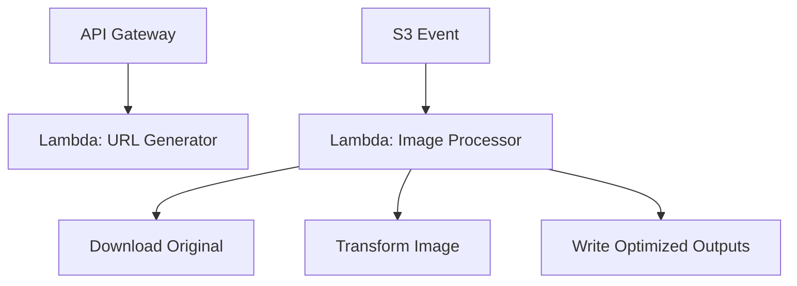

# 08 Lambda Architecture

## Purpose

This document explains the role of AWS Lambda in the system, especially from a Java perspective.

## Beginner-Friendly Explanation

Lambda is the system’s worker. One worker gives permission to upload, and another worker reacts after the image arrives and creates better versions for delivery.

## Why This Component Exists

Lambda handles two distinct jobs:

- A low-latency control-plane function that generates pre-signed URLs.
- A heavier event-driven processing function that transforms images after upload.

## Why Lambda Exists Here

Lambda handles two distinct jobs:

- A low-latency control-plane function that generates pre-signed URLs.
- A heavier event-driven processing function that transforms images after upload.

## Why Java Was Chosen

- Java is widely used in enterprise backends.
- It offers strong libraries, static typing, mature build tooling, and strong interview value.
- Learning Java in Lambda teaches you how JVM-based workloads behave under serverless constraints.

## Why Alternatives Were Not Chosen

- Spring Boot is avoided because it introduces framework startup overhead that is unnecessary for small focused Lambdas.
- A single all-purpose Lambda would mix different memory, timeout, and concurrency needs.
- Long-running servers would require capacity planning and more operational care.

## Lambda Execution Lifecycle

- Cold start:
  AWS creates a new execution environment and initializes the JVM and handler.
- Warm invocation:
  AWS reuses the environment, reducing startup overhead.
- Freeze and reuse:
  Global state may persist between invocations, which helps expensive client reuse but must be handled safely.

## Statelessness

Lambda functions should not depend on local in-memory state surviving. Reuse is a performance bonus, not a correctness dependency.

## Memory Allocation

Memory affects more than heap size. In Lambda, more memory often means more CPU allocation. That matters for image processing because CPU can reduce total duration enough to lower net cost.

## Timeout Strategy

- URL-generation Lambda should have a short timeout because it performs small control work.
- Image-processing Lambda needs a longer timeout that accounts for large images and object download time.

## JVM Behavior In Lambda

- Class loading and dependency initialization affect cold starts.
- Package size affects deployment and initialization overhead.
- Reusing AWS SDK clients between invocations improves efficiency.

## Diagram

## Request And Response Flow

1. API Gateway invokes the URL Lambda and receives a small signed-response payload.
2. S3 invokes the processing Lambda through an event after upload.
3. The processing Lambda reads the original object and writes optimized outputs.

## Production Considerations

- Keep each Lambda single-purpose.
- Tune memory and timeout independently per function.
- Use dead-letter or retry strategy carefully for the processor because repeated failures can become noisy and costly.

## Security Concerns

- URL Lambda should only have permission to generate pre-signed URLs for intended bucket paths.
- Processor Lambda should have only read access to raw objects and write access to optimized destinations.

## Cost Considerations

- Java cold starts can be heavier than some lighter runtimes, so packaging discipline matters.
- Higher memory can cost more per millisecond but sometimes reduce total duration enough to be worthwhile.

## Scaling Considerations

- URL generation can scale rapidly with user actions.
- Processing concurrency can spike from large upload batches and may need reserved concurrency or queue buffering in a more advanced design.

## Common Mistakes

- Treating Lambda like a small server and loading large frameworks unnecessarily.
- Setting very low memory for CPU-heavy image transformations.
- Ignoring duplicate event handling.

## Failure Scenarios

- Processor Lambda runs out of memory on high-resolution images.
- Cold starts create latency spikes for infrequently invoked URL-generation paths.
- Dependency size inflates startup time beyond acceptable user expectations.

## Debugging Mindset

When Lambda feels slow, ask:

- Is it cold start or execution time?
- Is the issue download time, transform time, or upload time?
- Is memory starving CPU?

## Interview Questions And Answers

- Why avoid Spring Boot in Lambda here?
  Because the use case needs lightweight handlers, not a full application framework with extra startup overhead.
- What is the most important Java-specific Lambda concern?
  Cold start and initialization cost management through dependency discipline and efficient runtime configuration.

## Best Practices

- Reuse SDK clients across invocations.
- Separate functions by behavior and resource profile.
- Optimize for startup simplicity before adding abstraction layers.
