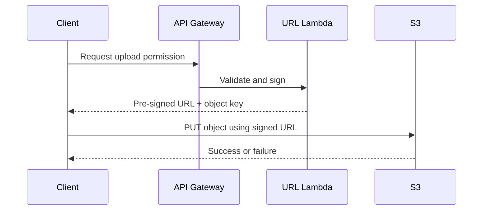

# 09 Pre-Signed URL Complete Guide

## Purpose

This document explains how pre-signed URLs work, why they are central to secure direct upload, and what tradeoffs they introduce.

## Why This Component Exists

The browser needs temporary permission to upload one file to one specific place without receiving long-lived AWS credentials. A pre-signed URL provides that limited permission.

## Beginner-Friendly Explanation

A pre-signed URL is like a temporary delivery pass:

- It allows a specific action.
- It works only for a short time.
- It applies to a specific object key and HTTP method.

The client gets permission without becoming a trusted AWS user.

## Why Alternatives Were Not Chosen

- Giving permanent credentials to the browser is unsafe.
- Routing the entire file through the backend is inefficient.
- Making the bucket publicly writeable is a major security risk.

## How It Works

1. Client asks the backend for upload permission.
2. Backend validates who is asking and what they want to upload.
3. Backend signs an S3 request using its own AWS permissions.
4. Client receives a time-limited URL and uploads directly to S3.

## Security Model

- Permission is limited by time.
- Permission is limited by object path and operation.
- The client does not gain reusable AWS access.

## Expiration Strategy

- Short expiration is better for security.
- Expiration must still leave enough time for realistic client upload behavior.
- Very long expirations increase abuse risk and make leaked URLs more dangerous.

## MIME Restrictions

- Validate expected content type before generating the URL.
- Treat client-provided MIME type as a hint, not as absolute truth.
- Re-check content type or file signature during processing if risk is meaningful.

## Upload Abuse Prevention

- Limit allowed file size and type.
- Scope URLs to a user-specific or tenant-specific prefix.
- Rate-limit URL creation.
- Log who requested the URL and for which asset key.

## Request And Response Flow

1. Client sends intended metadata.
2. Lambda validates the request.
3. Lambda creates the signed upload URL for a constrained key.
4. Client uploads with that URL.
5. S3 accepts or rejects based on the signature and request details.

## Diagram

## Production Considerations

- Consider enforcing object metadata fields for auditing.
- Decide whether URLs support only single-part uploads or larger multipart uploads later.
- Ensure key generation is server-controlled.

## Security Concerns

- Signed URLs can leak through logs or browser tooling if handled carelessly.
- Without path restrictions, a user could overwrite unintended objects.
- Without short TTLs, replay risk rises.

## Cost Considerations

- The URL generation path is cheap, but abuse can still drive request and logging costs.
- Bad validation can allow oversized uploads that later increase storage and processing cost.

## Scaling Considerations

- URL generation scales well because it is lightweight.
- The real scale benefit comes from removing the file body from the API path.

## Common Mistakes

- Allowing the client to choose any storage key.
- Setting long expiration times for convenience.
- Assuming signed URL security removes the need for bucket policy discipline.

## Failure Scenarios

- URL expires before upload finishes on a slow network.
- Client uses a different method or headers than the signed request expects.
- Processor receives a non-image object because validation was too weak.

## Debugging Mindset

When upload fails, verify:

- The URL had not expired.
- The method and headers matched the signed request.
- The target key and bucket were correct.
- S3 policy allowed the signed request pattern.

## Interview Questions And Answers

- Why are pre-signed URLs preferred here?
  They allow direct upload without exposing permanent credentials or forcing uploads through backend compute.
- Are pre-signed URLs enough for security?
  No. They are one control within a broader design that also needs IAM, bucket policy, validation, and monitoring.

## Best Practices

- Sign narrowly.
- Expire quickly.
- Validate aggressively before signing.
- Audit requests consistently.
