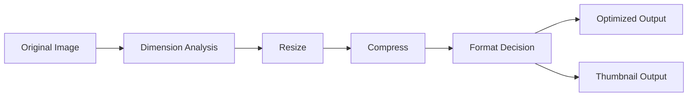

# 10 Image Processing Concepts

## Purpose

This document explains the conceptual side of resizing, compression, format handling, and image quality tradeoffs.

## Beginner-Friendly Explanation

Image processing means taking a raw uploaded image and turning it into versions that are smaller, faster, and more useful for real screens and network conditions.

## Why This Component Exists

Raw uploaded images are usually not suitable for direct delivery. They are often too large in dimensions, too large in file size, or poorly suited to browser delivery patterns.

## Core Concepts

- Resizing:
  Changes dimensions to better match display needs.
- Compression:
  Reduces file size while preserving acceptable quality.
- Thumbnail generation:
  Produces smaller preview images for lists, galleries, and cards.
- Format normalization:
  Converts images into formats that balance quality, transparency support, and size.

## Why Alternatives Were Not Chosen

- Delivering originals wastes bandwidth and hurts latency.
- One-size-fits-all processing ignores different device and UI needs.
- Storing every possible derivative version can explode storage cost.

## Quality Tradeoffs

- Higher quality keeps more visual detail but increases file size.
- Lower quality improves performance and cost but can create visible artifacts.
- The “best” quality is a product decision, not just a technical one.

## Formats

- JPEG:
  Good for photographs, strong compression, no transparency.
- PNG:
  Good for transparency and sharp graphic edges, often larger.
- WebP:
  Usually better compression efficiency for many web use cases, though compatibility and workflow needs should still be considered.

## Why WebP Vs JPEG Vs PNG Matters

The format choice affects browser performance, storage cost, perceived quality, and processing complexity. There is no universal winner. Use-case fit matters.

## Request And Response Flow

1. Processor downloads the original image.
2. It evaluates or applies target dimensions and output settings.
3. It writes one or more derived versions.

## Diagram

## Production Considerations

- Define a consistent rule for maximum width and height.
- Decide whether to preserve aspect ratio in all cases.
- Consider whether animated formats are allowed or rejected.

## Security Concerns

- Image decoders must be treated carefully because malformed files can trigger processing errors.
- Limit memory exposure for extremely large or malformed images.

## Cost Considerations

- More output variants mean more storage and more processing time.
- High CPU transformations may justify higher memory to finish faster.

## Scaling Considerations

- Processing cost scales with image count and image complexity.
- Popular products may need only a small set of standard output sizes to stay operationally simple.

## Common Mistakes

- Choosing output quality without measuring user-visible impact.
- Generating too many derivative sizes.
- Ignoring aspect ratio and causing distorted images.

## Failure Scenarios

- Very large images exceed memory or timeout budgets.
- Format conversion loses transparency unexpectedly.
- Over-compression creates poor user experience.

## Debugging Mindset

If output quality is poor, ask:

- Was the resize too aggressive?
- Was the compression level too high?
- Was the wrong format chosen for the asset type?

## Interview Questions And Answers

- Why not serve original uploads directly?
  Originals are often oversized for the browser and too expensive to store and deliver repeatedly.
- Why are format choices architectural?
  Because they affect performance, compatibility, user experience, and cost.

## Best Practices

- Standardize a small number of image profiles.
- Preserve aspect ratio by default.
- Treat optimization as a product performance feature.
