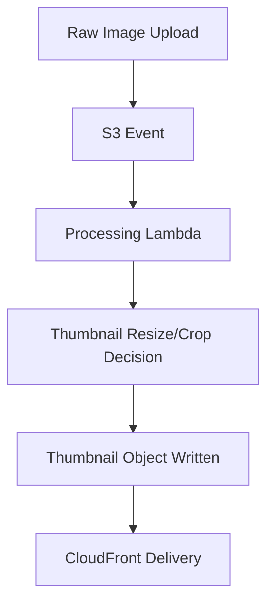

# 11 Thumbnail Generation

## Purpose

This document focuses specifically on thumbnail generation, why thumbnails deserve separate design thinking, and how to reason about them in production.

## Beginner-Friendly Explanation

A thumbnail is a small preview image. It lets pages show many images quickly without downloading the full-size version for each one.

## Why This Component Exists

Thumbnails are often the most frequently viewed version of an image. Search results, galleries, list pages, dashboards, and recommendation cards usually do not need full-size images.

## Why Alternatives Were Not Chosen

- Using original images everywhere wastes bandwidth and slows page rendering.
- Generating thumbnails on every request increases latency and origin work.

## Thumbnail Design Questions

- What sizes are needed?
- Should thumbnails be cropped or only resized?
- Should aspect ratio be preserved?
- Are thumbnails generated eagerly on upload or lazily on demand later?

## Eager Vs Lazy Generation

- Eager generation:
  Faster reads later, simpler delivery, but more upfront processing and storage.
- Lazy generation:
  Lower initial work, but more complexity and slower first request.

For this project, eager generation is a clearer beginner-friendly architecture.

## Request And Response Flow

1. Upload completes.
2. Processor Lambda generates a thumbnail as part of the same workflow.
3. Thumbnail is stored under a deterministic key.
4. CloudFront later serves that thumbnail path.

## Diagram

## Production Considerations

- Use consistent naming so clients can predict thumbnail paths.
- Decide whether square thumbnails should crop from center or preserve full image.
- Track whether thumbnail generation failed even if the main optimized output succeeded.

## Security Concerns

- The same untrusted file concerns apply as with main processing.
- Avoid exposing internal storage structure if thumbnail paths map directly to user content.

## Cost Considerations

- Thumbnails add write operations and storage, but often save far more in downstream transfer.
- Too many thumbnail sizes create long-term storage bloat.

## Scaling Considerations

- Thumbnail generation is usually cheap relative to full processing, but it still compounds during spikes.
- Standardized sizes help CDN cache efficiency.

## Common Mistakes

- Creating many near-duplicate thumbnail sizes.
- Ignoring crop strategy and producing inconsistent UI presentation.
- Not separating thumbnail failures from full-image failures in logs.

## Failure Scenarios

- Main optimized image exists but thumbnail is missing.
- Thumbnail crop strategy cuts important content for user-facing previews.
- Frontend expects a path pattern different from what processing produced.

## Debugging Mindset

When thumbnails fail, compare:

- Requested UI size
- Actual thumbnail dimensions
- Storage path convention
- Processing log outcome

## Interview Questions And Answers

- Why generate thumbnails separately?
  Because preview use cases have very different size and latency needs than full asset delivery.
- Why not resize in the browser?
  Browser-only resizing does not reduce server-side storage or global delivery cost, and it still requires downloading the large original.

## Best Practices

- Keep the number of thumbnail profiles small.
- Align thumbnail strategy with actual UI components, not hypothetical future needs.
