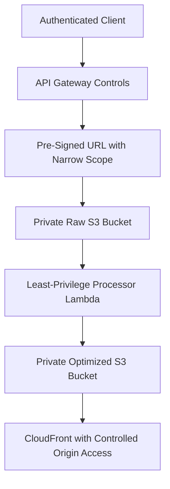

# 13 Security Architecture

## Purpose

This document explains how to secure the full system, including upload, storage, processing, and delivery.

## Beginner-Friendly Explanation

Security in this project means controlling who can upload, where they can upload, what the system will process, and how the final content can be accessed.

## Why This Component Exists

User-uploaded content systems are high-risk because they accept untrusted input, expose public endpoints, and often handle large volumes of data transfer.

## Why Security Exists As A First-Class Design Topic

User-uploaded content systems are high-risk because they accept untrusted input, expose public endpoints, and often handle large volumes of data transfer.

## Security Goals

- Only authorized users can request upload permission.
- Upload permission is limited, temporary, and scoped.
- Raw storage remains private.
- Processors run with least privilege.
- Delivered content is controlled through CDN and origin policy.

## Why Alternatives Were Not Chosen

- Public writeable buckets are unsafe.
- Broad IAM roles are easy at first but dangerous in production.
- Permanent browser credentials create unacceptable exposure.

## Layered Security Model

- API layer:
  Authentication, request validation, throttling.
- Storage layer:
  Private buckets, encryption, bucket policy, prefix restrictions.
- Compute layer:
  Least-privilege IAM, bounded timeouts, safe dependency choices.
- Delivery layer:
  CloudFront origin protection, HTTPS, optional signed delivery.

## Malware And Content Concerns

If users upload untrusted content, image validation alone may not be enough. Depending on business risk, you may need scanning, moderation workflows, and quarantined processing paths.

## Upload Restrictions

- Restrict file types.
- Restrict file sizes.
- Restrict upload destinations.
- Restrict URL lifetime.

## Diagram

## Request And Response Flow

1. User identity is evaluated.
2. Upload intent is validated.
3. Temporary upload permission is granted.
4. Storage accepts only the allowed write.
5. Processing reads and writes within scoped permissions.
6. Delivery occurs through controlled endpoints.

## Production Considerations

- Log security-relevant events such as repeated denied upload requests.
- Rotate keys and review IAM regularly.
- Define incident response for malicious upload attempts.

## Security Concerns

- Signed URLs leaking into logs.
- Bucket policies that are looser than intended.
- CloudFront origin bypass.
- Overly broad Lambda permissions.

## Cost Considerations

- Security controls such as logging and scanning add cost, but breaches and abuse cost more.
- Overly aggressive logging can become expensive without retention discipline.

## Scaling Considerations

- Security should scale with traffic through automated policy, not manual review alone.
- Rate limiting and access scoping become more important under growth.

## Common Mistakes

- Trusting client filenames and MIME types.
- Using wildcard permissions for convenience.
- Making optimized buckets public by default without strong reason.

## Failure Scenarios

- A signed URL is shared and reused before expiration.
- Lambda can read more buckets than intended.
- CloudFront is configured, but the S3 origin is still directly public.

## Debugging Mindset

When a security control blocks access, identify:

- Which identity made the request
- Which policy evaluated it
- Which resource path was targeted
- Whether the failure was expected or misconfigured

## Interview Questions And Answers

- Why is least privilege especially important here?
  Because the system touches public entry points, private storage, and untrusted content.
- Is a private S3 bucket enough by itself?
  No. You still need secure upload issuance, processing permissions, and controlled delivery.

## Best Practices

- Design every permission boundary deliberately.
- Treat user content as untrusted from upload through processing.
