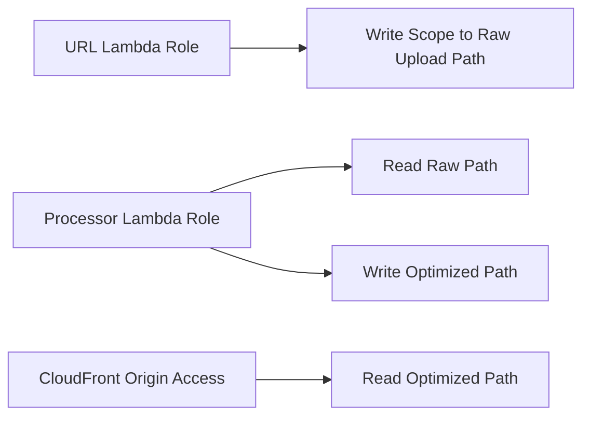

# 14 IAM Roles And Permissions

## Purpose

This document explains how to think about IAM in the project and how to separate permissions cleanly.

## Beginner-Friendly Explanation

IAM decides which part of the system is allowed to do which action. It is the permission map behind the architecture.

## Why This Component Exists

IAM is the guardrail that determines which service can do what, on which resource, and under which conditions.

## Why IAM Exists

IAM is the guardrail that determines which service can do what, on which resource, and under which conditions.

## Why This Matters Here

The architecture contains two different Lambdas, multiple storage paths, and a CDN origin. Without careful IAM, a small mistake can expose data or create operational confusion.

## Recommended Role Separation

- URL-generation Lambda role:
  Permission to sign uploads for a constrained raw bucket path.
- Image-processing Lambda role:
  Permission to read raw objects and write optimized objects.
- CloudFront origin access identity or control:
  Permission to read only the optimized delivery path.

## Why Alternatives Were Not Chosen

- One broad shared role is easier initially but increases blast radius.
- Wildcard permissions hide design mistakes until a security review or incident.

## Request And Response Flow

1. API Gateway invokes the URL Lambda under its execution role.
2. URL Lambda uses its permissions to create a narrowly scoped upload authorization.
3. S3 triggers the processor Lambda under a different role.
4. Processor reads raw content and writes derivatives under distinct access permissions.

## Diagram

## Least Privilege

Least privilege means:

- Limit actions.
- Limit resources.
- Limit scope by prefix when possible.
- Avoid permissions unrelated to the Lambda’s job.

## Production Considerations

- Review roles after design changes.
- Use naming that makes purpose obvious.
- Keep environment-specific policies separate if multiple stages exist.

## Security Concerns

- Over-broad permissions often go unnoticed because everything “works.”
- KMS permissions, if used, must also be aligned with bucket access.

## Cost Considerations

- IAM misconfiguration does not usually show up as a line item, but it can create expensive incidents, rework, or abuse exposure.

## Scaling Considerations

- As systems grow, precise IAM becomes more important because more services and people depend on the same account.

## Common Mistakes

- Granting `s3:*` on entire buckets.
- Reusing one execution role for both Lambdas.
- Forgetting to align bucket policy with IAM role intent.

## Failure Scenarios

- URL Lambda can sign unexpected paths.
- Processor can read raw objects but cannot write optimized outputs.
- CloudFront receives 403 because origin permissions are incomplete.

## Debugging Mindset

For access failures, identify:

- Which principal acted
- Which action was attempted
- Which resource ARN or path was targeted
- Whether bucket policy, IAM policy, or encryption policy denied access

## Interview Questions And Answers

- Why use separate roles for separate Lambdas?
  Because they perform different tasks and need different permissions; separation reduces blast radius.
- Is IAM enough without bucket policy?
  Not always. Resource policies add another control layer and can enforce stronger boundaries.

## Best Practices

- Prefer explicit permissions over wildcard convenience.
- Align IAM design with service responsibility boundaries.
