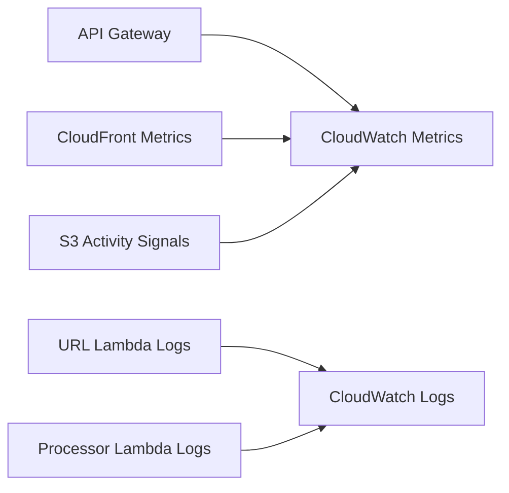

# 15 Observability And Monitoring

## Purpose

This document explains how to make the system visible, debuggable, and operable in production.

## Beginner-Friendly Explanation

Observability means being able to answer, with evidence, what happened to an upload and where it failed or slowed down.

## Why This Component Exists

Serverless systems remove server management, but they do not remove operational complexity. In fact, distributed managed services often make observability more important because failures occur across boundaries.

## What To Observe

- Upload URL request volume and errors
- Lambda invocation count, latency, memory pressure, and failures
- S3 event-trigger behavior
- Processing success versus failure rate
- CloudFront cache hit ratio and origin errors

## Why Alternatives Were Not Chosen

- “Just read logs when something breaks” is not enough in event-driven systems.
- Manual debugging without metrics becomes slow and reactive.

## Structured Logging

Use consistent fields such as:

- Request ID
- Asset ID
- Object key
- User or tenant identifier when appropriate
- Processing stage

That makes tracing a single asset across services much easier.

## Metrics

- Lambda duration and error count
- Lambda concurrent executions
- Processing success rate
- S3 object count growth
- CloudFront 4xx and 5xx rates
- Cache hit ratio

## Alarms

- Error rate above threshold
- Repeated processor failures
- Excessive duration increases
- Unexpected drop in cache hit ratio

## Diagram

## Request And Response Flow

1. A user action triggers a system event.
2. Each service emits logs and metrics.
3. Operators correlate those signals by asset key or request ID.
4. Alerts surface issues before users report them.

## Production Considerations

- Set log retention intentionally.
- Avoid logging sensitive data such as pre-signed URLs.
- Decide what “healthy” looks like before an incident happens.

## Security Concerns

- Logs can leak identifiers, paths, or tokens if handled carelessly.
- Monitoring access should also follow least privilege.

## Cost Considerations

- Log volume can become surprisingly expensive.
- Custom metrics are useful, but create them where they answer real operational questions.

## Scaling Considerations

- Observability must stay useful under high event volume.
- Standardized logging becomes more valuable as concurrency grows.

## Common Mistakes

- Logging too little to trace an asset.
- Logging too much raw data without retention or filtering.
- Relying on invocation success alone without measuring output quality and availability.

## Failure Scenarios

- Upload path works, but processor failures remain hidden until users report missing images.
- CloudFront hit ratio drops, causing origin load and cost increases without immediate detection.

## Debugging Mindset

Start with one asset and reconstruct its path:

- API request
- S3 upload
- S3 event
- Processor logs
- Optimized object presence
- CloudFront response

## Interview Questions And Answers

- Why is observability especially important in serverless systems?
  Because the system is distributed across managed boundaries and failures are not visible from a single host.
- What is more useful than raw log volume?
  Correlated logs and meaningful metrics tied to business and technical outcomes.

## Best Practices

- Log for traceability, not noise.
- Alarm on symptoms users would feel, not only infrastructure counters.
