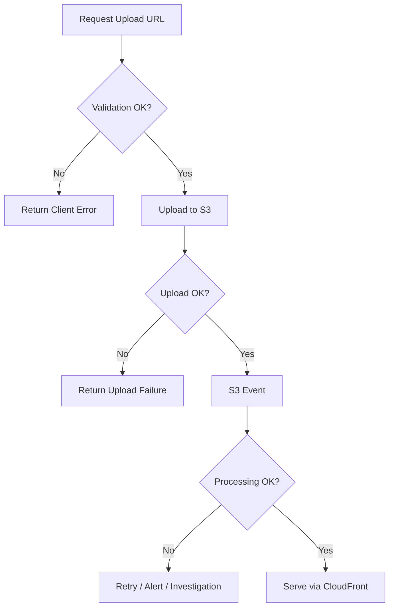

# 16 Error Handling Strategy

## Purpose

This document explains how to think about failure handling across API, storage, processing, and delivery.

## Beginner-Friendly Explanation

Error handling in this system means knowing which failures should be shown to the user immediately, which should be retried in the background, and which should trigger operator attention.

## Why This Component Exists

Distributed systems do not fail in one simple way. In this project, upload authorization, direct upload, event delivery, processing, and CDN delivery can each fail differently.

## Why Alternatives Were Not Chosen

- A single generic “something went wrong” response is not enough for operations or user experience.
- Retrying everything blindly can make cost and duplication worse.

## Error Categories

- Client validation errors
- Authorization errors
- Upload transfer errors
- Processing errors
- Delivery and cache errors

## Strategy By Stage

- API stage:
  Fail fast with clear validation responses.
- Upload stage:
  Let S3 reject mismatched or expired signed requests.
- Processing stage:
  Log richly, retry carefully, and ensure idempotent writes.
- Delivery stage:
  Use cache strategy and versioned object paths to reduce stale or missing content problems.

## Diagram

## Request And Response Flow

1. Validate input early.
2. Surface upload failures clearly to the client.
3. Treat processing as asynchronous work with retriable or terminal failure states.
4. Make delivery problems observable via CDN and origin metrics.

## Production Considerations

- Decide which errors are retryable.
- Ensure repeated S3 events do not corrupt output.
- Consider a dead-letter strategy if processing repeatedly fails.

## Security Concerns

- Error messages should help operators without exposing sensitive internals to clients.
- Avoid returning internal bucket or policy details in public responses.

## Cost Considerations

- Infinite or excessive retries can create runaway costs.
- Poor validation increases wasted processing on bad input.

## Scaling Considerations

- More traffic means more partial failures.
- Idempotency becomes essential when events are retried or duplicated.

## Common Mistakes

- Treating asynchronous processing as if it were guaranteed once-only execution.
- Overwriting good outputs with repeated failed attempts or partial writes.
- Mixing user-facing and operator-facing error detail.

## Failure Scenarios

- Lambda times out after reading the original but before writing output.
- Duplicate event causes the same asset to be processed twice.
- CDN caches a not-found response before the derivative exists.

## Debugging Mindset

Classify before acting:

- Is the failure permanent or retryable?
- Is it input-specific or system-wide?
- Did the failure occur before or after any side effect was written?

## Interview Questions And Answers

- Why is idempotency important in event-driven systems?
  Because retries and duplicate events are normal, and side effects must remain safe.
- What is a common mistake in serverless error handling?
  Assuming an event will be processed exactly once.

## Best Practices

- Fail early on bad requests.
- Retry only where repeated execution is safe.
- Separate client clarity from internal diagnostic detail.
