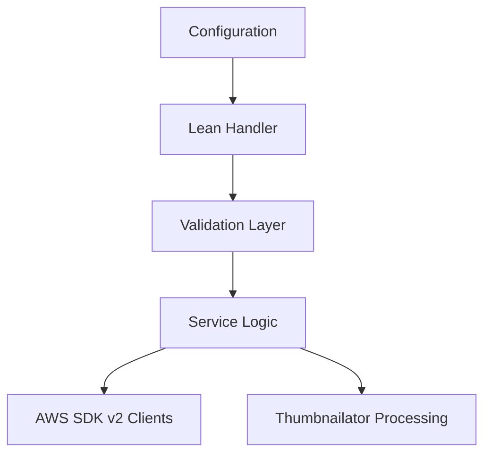

# 17 Java Engineering Best Practices

## Purpose

This document explains Java-specific design choices for lightweight Lambda development without turning the project into a full framework-heavy application.

## Beginner-Friendly Explanation

The goal is to use Java in a Lambda-friendly way: small handlers, small dependencies, clear responsibilities, and fast enough startup for serverless workloads.

## Why This Component Exists

Java is powerful in Lambda, but it needs discipline. A serverless handler should be lean, focused, and optimized for fast initialization and operational clarity.

## Key Principles

- Keep handlers small and single-purpose.
- Reuse expensive AWS SDK clients across invocations.
- Avoid unnecessary frameworks.
- Package only what the Lambda needs.
- Keep configuration externalized and simple.

## Why Alternatives Were Not Chosen

- Full enterprise frameworks provide many features but often add startup and dependency weight not needed here.
- Over-abstracted internal architectures make small Lambdas harder to reason about.

## AWS SDK For Java v2

AWS SDK v2 is preferred because it is modern, modular, and better aligned with efficient dependency selection. Modular dependencies help reduce package size compared with older monolithic approaches.

## Maven Discipline

- Lock dependency versions carefully.
- Avoid unnecessary transitive dependencies.
- Keep build outputs predictable and reproducible.

## Thumbnailator Choice

Thumbnailator is a good conceptual fit because it is lightweight compared with building a full custom image transformation stack. The point is not the library itself, but the principle of choosing focused dependencies.

## Diagram

## Request And Response Flow

1. Handler receives a small event.
2. It validates and routes to focused logic.
3. Shared clients and configuration are reused where safe.
4. The function returns a small response or writes output to S3.

## Production Considerations

- Keep package size and startup work under control.
- Separate business rules from transport-specific event parsing where possible.
- Standardize logging structure across Lambdas.

## Security Concerns

- Dependency hygiene matters because third-party libraries widen the attack surface.
- Avoid embedding secrets in code or package resources.

## Cost Considerations

- Better initialization patterns reduce duration waste.
- Smaller artifacts help deployment speed and reduce cold start overhead.

## Scaling Considerations

- Cleaner handlers are easier to evolve into multiple specialized Lambdas as volume grows.
- Modular dependencies support function-specific packaging.

## Common Mistakes

- Importing large frameworks for small handlers.
- Treating Lambda as if it were a long-lived server process.
- Allowing dependency sprawl.

## Failure Scenarios

- Heavy initialization makes first-user latency poor.
- Library conflicts increase package complexity and runtime instability.
- Shared mutable state introduces unsafe reuse across warm invocations.

## Debugging Mindset

When Java Lambda feels inefficient, inspect:

- Dependency size
- Initialization work
- Logging quality
- Client reuse patterns

## Interview Questions And Answers

- Why is Java still valuable in serverless?
  It is common in enterprise ecosystems and teaches strong runtime and packaging discipline.
- Why avoid framework heaviness here?
  Because the use case benefits more from lightweight startup and focused handlers than from broad framework features.

## Best Practices

- Favor small, explicit design over clever abstraction.
- Let the Lambda shape the Java architecture, not the other way around.
