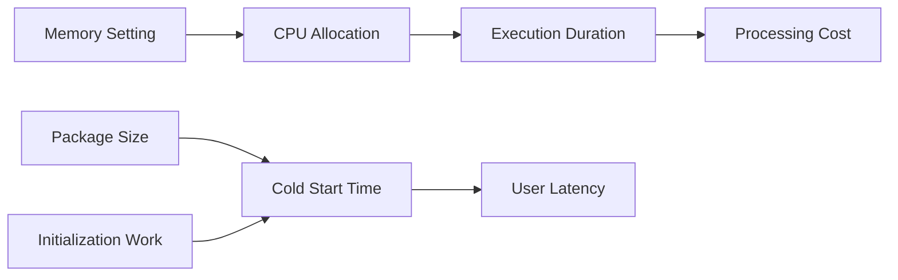

# 18 Memory And Cold Start Optimization

## Purpose

This document explains how to reason about Lambda memory sizing, cold starts, and Java-specific performance tuning in a serverless environment.

## Beginner-Friendly Explanation

Cold start is the extra setup time when Lambda has to create a fresh Java runtime. Memory sizing matters because it also changes how much CPU the function gets.

## Why This Component Exists

Java in Lambda is powerful, but its startup characteristics need careful attention. In this project, user-facing upload URL generation benefits from low latency, while image processing benefits from balanced CPU and memory.

## Cold Starts

A cold start happens when AWS must create a new execution environment and initialize the function. For Java, this includes JVM startup, class loading, dependency initialization, and any handler setup work.

## Why Cold Starts Matter Here

- The upload URL Lambda sits on the synchronous user path.
- The processor Lambda may be less user-visible but still affects readiness time and cost under bursts.

## Memory Allocation Strategy

In Lambda, memory also influences CPU allocation. For compute-heavy image operations, too little memory often means too little CPU, leading to long duration and possible timeouts.

## Why Alternatives Were Not Chosen

- Simply choosing the smallest memory to save money is a common mistake.
- Heavy framework initialization increases cold-start sensitivity without adding clear value here.

## Optimization Levers

- Reduce dependency footprint.
- Reuse clients across warm invocations.
- Separate small latency-sensitive functions from heavier processing functions.
- Tune memory empirically based on duration and cost behavior.

## Diagram

## Request And Response Flow

1. Lambda environment initializes or is reused.
2. Handler executes logic.
3. Memory and CPU determine how quickly CPU-bound image tasks finish.
4. Warm reuse reduces repeated initialization cost.

## Production Considerations

- Tune the two Lambdas separately because their workloads differ.
- Monitor p95 and p99 duration, not just average duration.
- Keep initialization work outside the request path only when reuse is safe.

## Security Concerns

- Performance shortcuts should not bypass validation or reduce logging needed for incident analysis.

## Cost Considerations

- Higher memory can increase per-millisecond price.
- Longer duration from under-provisioning can still make total cost worse.
- The best setting is usually found through measurement, not intuition.

## Scaling Considerations

- Under bursty traffic, cold starts become more visible because more new environments may be created.
- Better packaging and lighter initialization improve burst behavior.

## Common Mistakes

- Optimizing only for low memory instead of total cost and latency.
- Using one configuration for both Lambdas.
- Ignoring p99 cold-start impact on user-facing endpoints.

## Failure Scenarios

- URL Lambda becomes slow after long idle periods because cold starts dominate.
- Processor times out on large images due to low memory and CPU.
- Package growth over time quietly worsens latency.

## Debugging Mindset

When performance regresses, check:

- Artifact size changes
- Dependency additions
- Memory configuration
- Cold-start frequency versus warm execution time

## Interview Questions And Answers

- Why can increasing Lambda memory reduce cost?
  Because it often increases CPU enough to cut total execution time substantially.
- Why is Java cold-start optimization important?
  Because JVM initialization overhead can be noticeable on synchronous serverless paths.

## Best Practices

- Measure, do not guess.
- Keep startup lean.
- Treat latency-sensitive and batch-like Lambdas differently.
