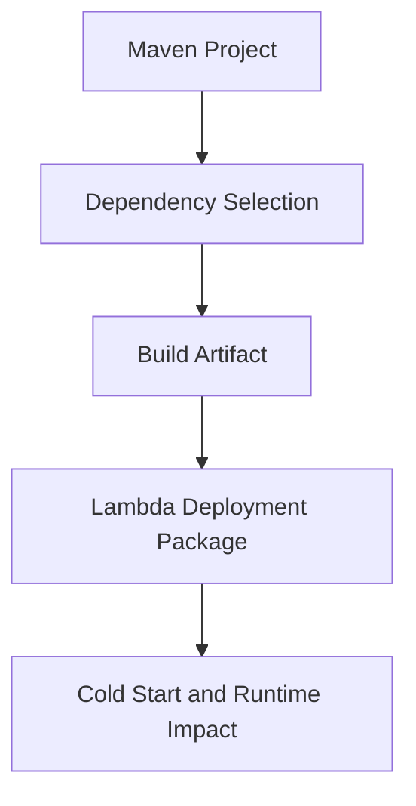

# 19 Maven Packaging Guide

## Purpose

This document explains how to think about Maven packaging for Java Lambda functions without showing implementation code.

## Beginner-Friendly Explanation

Packaging is the process of turning your Java project and its dependencies into the artifact Lambda will run. In serverless systems, that artifact size directly affects startup behavior and maintainability.

## Why This Component Exists

Packaging affects deployment artifact size, dependency clarity, reproducibility, and cold-start performance. In serverless Java, build discipline directly affects runtime behavior.

## Why Maven Was Chosen

- Standard Java build tool.
- Strong dependency management.
- Familiar in enterprise teams.
- Good interview value because many Java shops use it.

## Why Alternatives Were Not Chosen

- Gradle is also capable, but Maven is often easier for beginners to read due to its declarative style.
- Ad hoc manual packaging is not reproducible and becomes error-prone quickly.

## Packaging Goals

- Produce predictable artifacts.
- Include only required dependencies.
- Keep artifacts as small as practical.
- Support separate packaging per Lambda if functions evolve independently.

## Dependency Strategy

- Use AWS SDK for Java v2 modules selectively.
- Avoid large unused transitive dependency trees.
- Choose focused libraries such as Thumbnailator rather than broad frameworks.

## Diagram

## Request And Response Flow

1. Source and dependencies are assembled by Maven.
2. A deployable artifact is produced.
3. Lambda loads that artifact during initialization.

## Production Considerations

- Reproducible builds matter for troubleshooting and rollback confidence.
- Version pinning reduces surprise from shifting dependency behavior.
- Separate artifacts per function can improve clarity and reduce package weight.

## Security Concerns

- Track dependency provenance and known vulnerabilities.
- Keep the supply chain small and intentional.

## Cost Considerations

- Leaner packaging can reduce startup waste and operational friction.
- Bloated artifacts increase cold-start time and deployment complexity.

## Scaling Considerations

- At larger scale, package discipline matters more because cold starts affect more concurrent environments.

## Common Mistakes

- Adding many libraries “just in case.”
- Sharing one oversized artifact across unrelated functions.
- Ignoring transitive dependency growth.

## Failure Scenarios

- Artifact becomes too heavy and user-facing Lambda latency degrades.
- Conflicting library versions create runtime instability.
- Build is not reproducible, making incident rollback slow and confusing.

## Debugging Mindset

If packaging becomes a problem, inspect:

- Artifact size trend
- New dependency graph changes
- Whether each dependency is actually needed

## Interview Questions And Answers

- Why does packaging matter in Lambda more than on a long-lived server?
  Because initialization happens repeatedly across environments and directly affects cold-start performance.
- Why is modular AWS SDK usage helpful?
  It limits unnecessary dependencies and helps keep the artifact focused.

## Best Practices

- Keep build outputs lean, explicit, and reproducible.
- Treat dependency selection as a runtime design decision.
