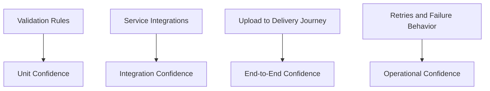

# 20 Testing Strategy

## Purpose

This document explains how to validate the system conceptually and operationally, even before writing production code.

## Beginner-Friendly Explanation

Testing here is not only about whether one function works. It is about whether the whole upload-to-delivery chain behaves correctly, securely, and predictably.

## Why This Component Exists

The project spans multiple managed services. Testing must cover not only logic correctness, but also event flow, permissions, and failure behavior.

## Testing Layers

- Unit-level logic testing:
  Input validation, key naming, configuration rules, and processing decisions.
- Integration testing:
  API Gateway to Lambda, Lambda to S3, S3 event to processor.
- End-to-end testing:
  Browser-style upload to final CloudFront delivery path.
- Operational testing:
  Failure injection, retries, timeouts, and observability verification.

## Why Alternatives Were Not Chosen

- Only testing the happy path misses most real serverless risk.
- Manual console-only testing does not scale or document confidence.

## Diagram

## Request And Response Flow

1. Validate control-path behavior.
2. Validate upload success and event trigger behavior.
3. Validate processing outputs and object naming.
4. Validate CDN delivery and cache behavior.

## Production Considerations

- Test duplicate event handling.
- Test large-image timeout and memory behavior.
- Test unsupported content types and rejected uploads.

## Security Concerns

- Include negative tests for unauthorized upload attempts.
- Validate that signed URLs cannot target unintended prefixes.

## Cost Considerations

- Keep test assets small where possible.
- Avoid unnecessary large-scale transformation tests in shared environments.

## Scaling Considerations

- Load tests should focus separately on URL generation and image-processing concurrency.
- Read-path scale can be approximated by cache-hit and miss scenarios through CloudFront.

## Common Mistakes

- Testing only API responses without confirming S3 and CloudFront behavior.
- Skipping failure-path tests because the happy path already works.
- Ignoring idempotency tests.

## Failure Scenarios

- End-to-end works for small images but fails for large uploads.
- URL generation is correct, but CORS blocks browser behavior.
- Processing succeeds, but output paths do not match delivery expectations.

## Debugging Mindset

When a test fails, isolate whether the issue is:

- Contract mismatch
- Permission error
- Event trigger issue
- Processing bug
- Cache behavior mismatch

## Interview Questions And Answers

- Why are integration tests especially important here?
  Because the system depends on managed service boundaries where many practical failures happen.
- What is a must-test property in event-driven processing?
  Idempotency under retries and duplicate events.

## Best Practices

- Treat testing as system validation, not just code validation.
- Cover happy paths, abuse paths, and operational failure paths.
