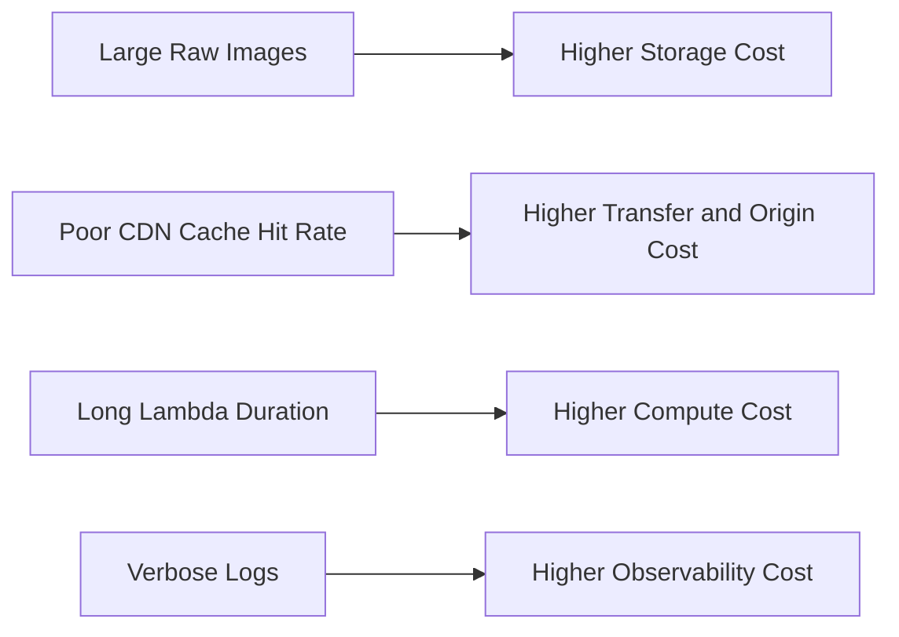

# 21 Cost Optimization And Free Tier Safety

## Purpose

This document explains how to reason about cost, stay safe while learning, and avoid accidentally expensive architecture choices.

## Beginner-Friendly Explanation

Cloud cost in this project comes from storing files, processing images, delivering them, and keeping logs. Small design choices can change all four.

## Why This Component Exists

Serverless is often cost-efficient, but not automatically cheap. Image storage, data transfer, repeated processing, and verbose logging can all add up.

## Main Cost Drivers

- S3 storage for raw and optimized images
- S3 request volume
- Lambda invocation count and duration
- CloudFront request and transfer volume
- API Gateway request volume
- CloudWatch log ingestion and retention

## Free Tier Safety Principles

- Keep uploads small during learning.
- Use a narrow test set of images.
- Set log retention instead of keeping everything forever.
- Remove unused objects and stale distributions when done experimenting.

## Why Alternatives Were Not Chosen

- Always-on servers may incur idle cost even when unused.
- Backend-proxied uploads waste compute and bandwidth.

## Cost Reduction Strategies

- Optimize images aggressively but sensibly.
- Use CloudFront caching to reduce repeated origin reads.
- Keep the API limited to small authorization requests.
- Avoid unnecessary derivative sizes.
- Retain raw originals only as long as needed.

## Diagram

## Request And Response Flow

1. Upload volume affects storage and processing cost.
2. Delivery volume affects CloudFront and transfer cost.
3. Observability choices affect long-term operations cost.

## Production Considerations

- Add budgets and billing alarms in real deployments.
- Track per-asset processing cost assumptions before generating many variants.
- Consider asset retention policy as part of product design.

## Security Concerns

- Abuse prevention is also cost protection.
- Repeated signed URL requests or malicious uploads can become a financial issue.

## Cost Considerations

- Smaller files improve both storage and transfer economics.
- Versioning and invalidations should be used intentionally because they can add hidden cost.

## Scaling Considerations

- Costs that are tiny in a demo can become meaningful with millions of requests.
- High cache hit rate becomes increasingly valuable as traffic grows.

## Common Mistakes

- Leaving CloudWatch logs unbounded.
- Generating many unused image sizes.
- Forgetting that raw originals may dominate storage cost over time.

## Failure Scenarios

- A bug repeatedly reprocesses the same image and multiplies cost.
- A public delivery path gets hot traffic without effective CDN caching.
- Large user uploads exceed expected budget assumptions.

## Debugging Mindset

If cost rises unexpectedly, ask:

- Is storage growth from raw images or derivatives?
- Are Lambda durations increasing?
- Is cache hit ratio dropping?
- Are logs exploding in volume?

## Interview Questions And Answers

- Why can optimization lower both performance risk and cloud spend?
  Because smaller assets reduce storage, transfer, and delivery overhead simultaneously.
- What is the safest free-tier habit here?
  Keep test data small, expire unused assets, and watch logs and transfer closely.

## Best Practices

- Design for cost visibility from the beginning.
- Treat free-tier safety as an architectural discipline, not an afterthought.
