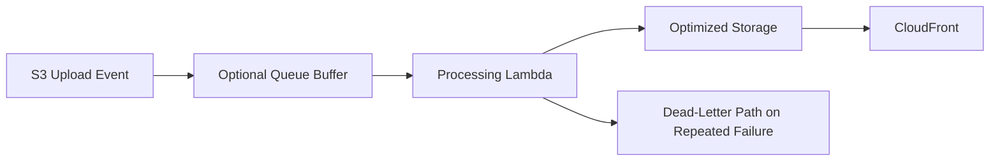

# 22 Production Improvements

## Purpose

This document outlines how the design can evolve from a solid learning architecture into a stronger production platform.

## Beginner-Friendly Explanation

The first version of a good architecture should be simple enough to understand. Production improvements are the extra layers you add once you know which risks and traffic patterns actually matter.

## Why This Component Exists

The base architecture is intentionally simple. Production systems often need more resilience, governance, and operational control.

## Improvement Areas

- Add queue-based buffering between S3 events and processing if bursts become difficult to manage.
- Add dead-letter handling for repeated failures.
- Add malware scanning or moderation workflows for untrusted content.
- Add richer asset metadata tracking and processing status storage.
- Add multiple image profiles for device-specific delivery.

## Why Alternatives Were Not Chosen

The goal of the core design is clarity. Adding too many advanced services too early can make the main learning path harder to follow.

## Diagram

## Request And Response Flow

1. Preserve the simple upload flow.
2. Add resilience components only where real failure or scaling patterns justify them.
3. Evolve observability and governance as asset volume grows.

## Production Considerations

- Introduce stepwise complexity, not all at once.
- Keep service ownership and runbook clarity as the system grows.
- Reassess naming, retention, and cache strategy when multi-tenant scale appears.

## Security Concerns

- Added workflows must not widen permissions carelessly.
- Moderation pipelines require careful access control and auditability.

## Cost Considerations

- More resilience components add cost, but often reduce incident and reprocessing cost.
- On-demand transformations can save storage but add compute and latency complexity.

## Scaling Considerations

- Queue buffering smooths spikes.
- Separate processing by image class or priority if workloads diverge.
- Multi-region delivery and disaster planning may matter for larger businesses.

## Common Mistakes

- Adding complexity before traffic patterns justify it.
- Failing to revisit earlier decisions like prefix design or cache strategy as the system evolves.

## Failure Scenarios

- A simple event-only design struggles during a large ingestion burst.
- Advanced features are added but logging and ownership remain unclear.

## Debugging Mindset

When deciding on improvements, ask:

- What concrete problem are we solving?
- Is it latency, resilience, cost, security, or governance?
- Can we solve it with policy before adding new infrastructure?

## Interview Questions And Answers

- What would you add first in production hardening?
  Better observability, clearer retries, and buffering or dead-letter strategy for processing failures.
- Why not add everything from day one?
  Because complexity has a cost, and simple systems are easier to understand, operate, and improve iteratively.

## Best Practices

- Evolve architecture in response to measured needs.
- Keep the mental model simple even as resilience improves.
