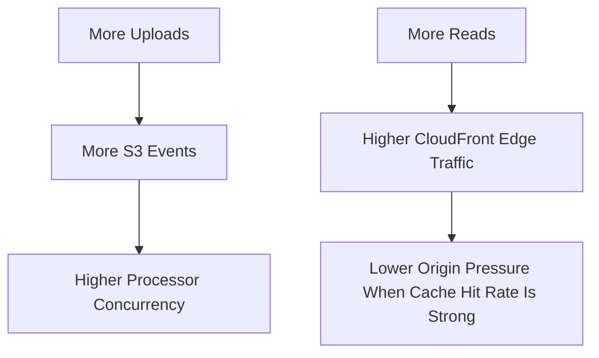

# 23 Scaling Considerations

## Purpose

This document explains how the system behaves as traffic and asset volume grow.

## Beginner-Friendly Explanation

Scaling means handling more uploads, more image processing work, and far more image reads without making the system slow, fragile, or unexpectedly expensive.

## Why This Component Exists

Scaling is not only about “can AWS handle it.” It is about whether the architecture scales predictably, affordably, and operationally cleanly.

## Read Scale Vs Write Scale

- Write scale:
  Bursty uploads, event triggers, processing concurrency.
- Read scale:
  Large repeated delivery traffic, usually much greater than upload traffic.

The architecture is intentionally designed to separate those paths.

## Why Alternatives Were Not Chosen

- A single backend handling upload and delivery would couple two very different scaling patterns.
- Synchronous processing would force user latency to grow with processing workload.

## What Scales Well

- S3 handles very large object counts and request rates.
- CloudFront handles high read traffic globally.
- Lambda scales elastically for bursty events, within concurrency limits.

## What Needs Attention

- Image-processing concurrency during large upload spikes
- Duplicate events and retry behavior
- Cache strategy for frequently updated objects
- Cost at scale, especially transfer and storage

## Diagram

## Request And Response Flow

1. Upload scale drives event volume.
2. Processing scale drives Lambda concurrency and runtime cost.
3. Delivery scale is absorbed mainly by CloudFront when caching is effective.

## Scaling Considerations

- Upload and read traffic should be treated as separate scaling problems.
- Concurrency controls and cache efficiency are the main levers as volume grows.
- Cost-efficient scaling depends on good optimization and strong CDN hit rates.

## Production Considerations

- Consider reserved concurrency to protect other workloads.
- Add buffering if processing spikes become too sharp.
- Prefer immutable keys for new content versions to keep caching efficient.

## Security Concerns

- Traffic growth also increases abuse surface.
- Throttling and scoped permissions become more important as volume rises.

## Cost Considerations

- Scaling successfully but inefficiently can still become a business problem.
- High read volume is affordable only if caching remains strong.

## Common Mistakes

- Focusing only on upload scale and forgetting read scale.
- Ignoring concurrency limits until burst traffic appears.
- Using cache-hostile object naming for updated assets.

## Failure Scenarios

- Upload burst overwhelms processing concurrency.
- Cache miss rate remains high because content churn or headers are misconfigured.
- Repeated image variants multiply storage faster than expected.

## Debugging Mindset

When scale issues appear, identify which dimension is stressed:

- Upload path
- Event path
- Processing path
- Delivery path
- Cost path

## Interview Questions And Answers

- What is the main scaling advantage of this architecture?
  It decouples upload, processing, and delivery so each can scale according to its own traffic pattern.
- What usually becomes the biggest long-term traffic component?
  Read delivery, which is why CloudFront is so important.

## Best Practices

- Scale paths independently.
- Measure concurrency, cache performance, and storage growth as first-class signals.
