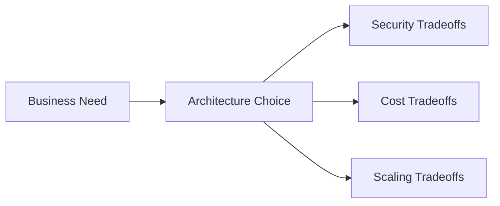

# 24 Interview Questions

## Purpose

This document gives interview-focused questions and compact model answers that help you explain the project confidently.

## Beginner-Friendly Explanation

This section helps you turn the architecture into clear speaking points. The goal is not to memorize buzzwords, but to explain tradeoffs confidently and simply.

## Why This Component Exists

Many candidates can describe services individually. Fewer can explain why the architecture is shaped the way it is. This section helps bridge that gap.

## Why Alternatives Were Not Chosen

Simple service definitions are not enough in interviews. Interviewers usually want to hear why this architecture was chosen over backend-proxied uploads, synchronous processing, or direct origin delivery.

## Diagram

## Request And Response Flow

1. Start with the business problem.
2. Move to upload authorization and direct S3 upload.
3. Explain asynchronous processing.
4. Finish with CDN delivery, security, cost, and scaling tradeoffs.

## Interview Questions And Answers

- What problem does this project solve?
  It provides a scalable way to upload, optimize, and globally deliver user images with lower latency and lower cost than a naive backend-upload design.

- Why use pre-signed URLs?
  They allow direct browser-to-S3 upload without exposing permanent credentials and without forcing file bodies through the backend.

- Why use two Lambdas instead of one?
  URL generation and image processing have different latency goals, scaling behavior, timeout needs, and IAM permissions.

- Why avoid Spring Boot in this Lambda architecture?
  Because the use case benefits from lightweight handlers and lower cold-start overhead rather than a full application framework.

- Why is S3 event-driven processing a good fit?
  It decouples upload from transformation and lets the system scale asynchronously with storage events.

- Why use CloudFront if S3 can already serve files?
  CloudFront provides global caching, lower latency, reduced origin load, and stronger delivery control.

- What are the biggest security risks?
  Overly broad upload permissions, public bucket exposure, signed URL abuse, and insufficient validation of untrusted user content.

- What are the biggest cost drivers?
  Storage volume, data transfer, Lambda duration, and logging volume.

- What is the main eventual consistency tradeoff?
  Upload success does not guarantee the optimized image is instantly available because processing is asynchronous.

- How would you improve this design for production?
  Add stronger observability, clearer failure handling, optional queue buffering, richer content validation, and more deliberate metadata or status tracking.

## Production Considerations

- Interviewers often care whether you understand why this design is simple first and extensible later.
- Be ready to discuss how you would harden the system without losing architectural clarity.

## Security Concerns

- Always mention least privilege, private S3 origins, short-lived signed URLs, and validation.

## Cost Considerations

- Mention that optimization and caching improve both user experience and cloud economics.

## Scaling Considerations

- Emphasize separation of upload, processing, and delivery paths.

## Common Mistakes

- Explaining only the services, not the reasoning.
- Forgetting to mention eventual consistency and idempotency.
- Treating CDN as a cosmetic add-on rather than a core scaling component.

## Failure Scenarios

- Optimized asset missing after successful upload
- Duplicate event processing
- Stale CDN cache after object replacement

## Debugging Mindset

In interviews, show that you would trace the request from upload authorization through S3 persistence, event trigger, processing, and CDN delivery.

## Best Practices

- Answer in terms of tradeoffs, not just features.
- Tie technical choices back to latency, cost, security, and scale.
