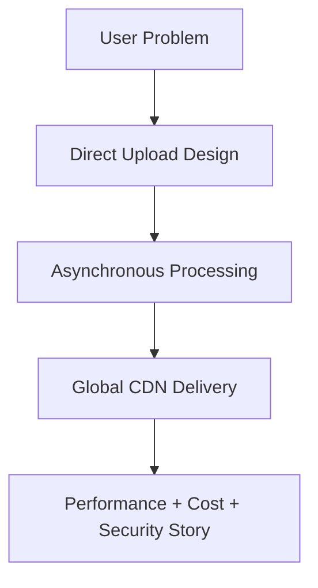

# 25 Resume Explanation

## Purpose

This document helps you present the project effectively on a resume and explain it clearly in conversation.

## Beginner-Friendly Explanation

The simplest way to present this project is as a cloud system that makes image upload secure, image delivery fast, and backend infrastructure lighter.

## Why This Component Exists

A strong project is only valuable if you can communicate it in a way that shows engineering judgment, not just tool familiarity.

## Resume Framing

This project should be framed as a cloud architecture and performance optimization project, not only as an image upload feature.

## Suggested Value Narrative

- Designed a serverless media pipeline for secure direct uploads, asynchronous image optimization, and low-latency global delivery.
- Reduced backend bandwidth dependency by using pre-signed direct-to-S3 upload.
- Improved delivery efficiency through image optimization and CloudFront caching.
- Applied security and operational thinking through IAM scoping, private storage, and observability planning.

## Why Alternatives Were Not Chosen

- Saying “built an S3 upload app” undersells the system.
- Focusing only on service names makes the project sound tool-driven instead of architecture-driven.

## Diagram

## Request And Response Flow

1. Describe the user problem.
2. Explain the direct-upload decision.
3. Explain the event-driven optimization step.
4. Explain the CloudFront delivery path.
5. Close with tradeoffs and production thinking.

## How To Explain It In Interviews

1. Start with the business problem:
   users upload large images and need fast global delivery.
2. Explain the main architecture move:
   direct upload to S3 using pre-signed URLs.
3. Explain the asynchronous optimization stage:
   S3 events trigger Java Lambda processing.
4. Explain the delivery stage:
   CloudFront caches optimized images globally.
5. Close with tradeoffs:
   eventual consistency, security controls, and cost optimization.

## Production Considerations

- Talk about how you would harden it, not just how it works in theory.
- Mention observability, abuse prevention, and scaling strategy.

## Security Concerns

- Include least privilege, private buckets, scoped signed URLs, and upload validation in your explanation.

## Cost Considerations

- Mention that optimizing images and caching with CloudFront reduce both latency and spend.

## Scaling Considerations

- Highlight that the design separates upload, processing, and delivery concerns so they scale independently.

## Common Mistakes

- Listing AWS services without explaining why they were used.
- Describing the project as basic CRUD or file upload work.
- Forgetting to mention the performance and cost story.

## Failure Scenarios

- If asked what could go wrong, mention processing failures, duplicate events, stale cache, and malformed uploads.

## Debugging Mindset

Show that you would trace issues stage by stage rather than guessing.

## Interview Questions And Answers

- What is the strongest resume signal in this project?
  It shows system design maturity across API, storage, compute, security, delivery, and operations.
- How should you describe the project in one sentence?
  It is a serverless AWS media pipeline for secure direct upload, asynchronous optimization, and globally cached image delivery.

## Best Practices

- Present outcomes and tradeoffs, not only tools.
- Speak in terms of business impact plus architecture reasoning.
