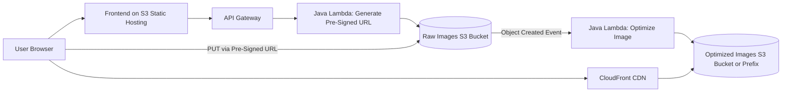

# Serverless Content Delivery & Optimization API (Media Focus)

This repository is a beginner-friendly but production-grade study guide for designing a serverless image upload, optimization, and global delivery platform on AWS using Java-based Lambda functions. The goal is to help you understand the architecture deeply enough to explain it in interviews and later implement it independently.

## Project Overview

Users upload images through a browser-based frontend. The frontend does not send the file through the backend. Instead, it requests a short-lived pre-signed upload URL from an API. The client then uploads the image directly to Amazon S3. An S3 event triggers an image-processing Lambda that resizes, compresses, and generates thumbnails. Optimized assets are served globally through Amazon CloudFront.

## Beginner-Friendly Explanation

This project is a cloud-based image pipeline. One part gives the browser secure temporary permission to upload. Another part cleans and resizes the image in the background. A final part delivers the result quickly around the world.

## Why This Component Exists

This repository exists to teach the architecture as a complete system rather than as isolated AWS services. It is designed for learners who want to understand the why, how, tradeoffs, and interview story before writing code.

## Why Alternatives Were Not Chosen

This documentation-first approach avoids jumping straight into implementation. That makes it easier to understand direct uploads, event-driven processing, CDN delivery, and Java Lambda tradeoffs without getting distracted by code details too early.

## Diagram

Architecture image:

## Technologies Used

- Java for Lambda functions because Java is common in enterprise teams and valuable for interviews.
- AWS SDK for Java v2 because it is the modern, modular AWS SDK with better performance patterns than v1.
- Maven for packaging, dependency management, and reproducible builds.
- Thumbnailator for lightweight image resizing and compression.
- API Gateway for controlled API exposure and throttling.
- Amazon S3 for durable object storage and event triggers.
- Amazon CloudFront for global caching and low-latency image delivery.
- IAM for least-privilege access control.
- CloudWatch for logs, metrics, and operational visibility.

## Request And Response Flow

1. The frontend requests an upload URL for a specific file type and object key.
2. API Gateway invokes a Java Lambda that validates the request and returns a short-lived pre-signed S3 URL.
3. The browser uploads the image directly to S3 using that URL.
4. S3 emits an object-created event.
5. The image-processing Lambda downloads the object, resizes it, compresses it, and creates a thumbnail.
6. The optimized outputs are stored in a private optimized bucket or controlled prefix.
7. CloudFront serves the optimized asset globally and caches it near users.

## Learning Outcomes

After reading this repository, you should be able to:

- Explain why direct-to-S3 upload is more scalable than proxying files through a backend.
- Describe how event-driven systems decouple upload from processing.
- Discuss tradeoffs between S3 prefixes versus separate buckets.
- Explain pre-signed URL security, expiration, and abuse prevention.
- Reason about Lambda cold starts, JVM tuning, and packaging choices in Java.
- Describe how CloudFront improves latency, reduces origin load, and affects cache behavior.
- Talk about observability, cost controls, failure handling, and production hardening.

## Resume Value

This project demonstrates:

- Real cloud architecture thinking, not just CRUD API knowledge.
- Practical AWS service integration across storage, compute, networking, security, and monitoring.
- Understanding of distributed systems tradeoffs such as asynchronous processing and eventual consistency.
- Strong interview signal for backend, cloud, and platform engineering roles.

## Project Milestones

1. Define the business problem and service boundaries.
2. Design the request flow for upload URL generation.
3. Design S3 bucket layout, naming, and lifecycle strategy.
4. Define Lambda responsibilities and event contracts.
5. Plan image optimization formats, quality strategy, and thumbnail rules.
6. Add security controls for upload validation and private delivery.
7. Add monitoring, alarms, retries, and dead-letter handling.
8. Review cost, scaling, and production-readiness improvements.

## AWS Services Map

| Service | Role in the System | Why It Matters |
| --- | --- | --- |
| Amazon S3 | Raw and optimized image storage | Durable, scalable, event-capable object storage |
| API Gateway | Public API entry point | Authentication, throttling, request validation |
| AWS Lambda | URL generation and image processing | Serverless compute with event-driven scaling |
| Amazon CloudFront | Global image delivery | Lower latency, caching, origin protection |
| AWS IAM | Access control | Least privilege across services |
| Amazon CloudWatch | Logs and metrics | Monitoring, alerting, debugging |
| S3 Event Notifications | Processing trigger | Decoupled asynchronous workflow |

## Recommended Reading Order

Start with the business and architecture documents, then move into service-specific deep dives, then finish with operations, optimization, and interview preparation.

- [01-project-overview.md](./01-project-overview.md)
- [02-business-problem.md](./02-business-problem.md)
- [03-system-architecture.md](./03-system-architecture.md)
- [04-end-to-end-request-flow.md](./04-end-to-end-request-flow.md)
- [05-aws-services-deep-dive.md](./05-aws-services-deep-dive.md)

## Diagram Library

- [diagrams/architecture-overview.md](../diagrams/architecture-overview.md)
- [diagrams/local-development-architecture.md](../diagrams/local-development-architecture.md)
- [diagrams/production-aws-architecture.md](../diagrams/production-aws-architecture.md)
- [diagrams/request-sequence.md](../diagrams/request-sequence.md)
- [diagrams/data-lifecycle.md](../diagrams/data-lifecycle.md)

## Production Considerations

- Keep raw and optimized storage paths clearly separated.
- Tune the two Lambdas independently because they have different runtime behavior.
- Plan observability, retries, and cache strategy before implementation.

## Security Concerns

- Upload permission must be short-lived and tightly scoped.
- Buckets should remain private unless public access is a deliberate decision.
- Least-privilege IAM and CloudFront origin protection are foundational.

## Cost Considerations

- Oversized raw images increase storage and transfer cost quickly.
- Good optimization and CDN caching improve both performance and spend.
- Logging and repeated reprocessing should be controlled intentionally.

## Scaling Considerations

- Upload control, image processing, and global delivery scale differently.
- CloudFront absorbs most read-heavy traffic.
- Lambda concurrency and processing cost need attention during upload bursts.

## Common Mistakes

- Sending file bodies through the backend.
- Treating CDN as optional rather than central to delivery.
- Ignoring eventual consistency after asynchronous processing.

## Failure Scenarios

- Upload succeeds but processing fails, leaving no optimized output.
- CloudFront serves stale or missing content because cache strategy was weak.
- Poor validation allows unsupported or malicious uploads into the pipeline.

## Debugging Mindset

Trace one asset through the full path: URL issuance, S3 upload, S3 event, processing logs, optimized object creation, and CloudFront delivery behavior.

## Interview Questions And Answers

- Why is direct upload important?
  It removes the backend from the large file-transfer path and makes the architecture more scalable.
- Why is this a strong cloud project?
  It combines storage, events, compute, CDN delivery, security, observability, cost, and Java-specific runtime tradeoffs.

## Best Practices

- Learn the architecture in layers: business problem, request flow, service deep dives, then production hardening.
- Keep the mental model clear by giving each AWS service one primary responsibility.

## Important Guardrail

This repository intentionally avoids implementation code. The focus is architecture, reasoning, production practices, and interview-quality understanding.
